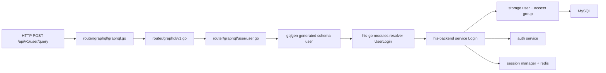

**General Development Workflow of HISv3 Backend**
```Markdown
1. Bikin graph di `his-go-modules`, termasuk generate
2. Hasil Generate : `generated.go`, `model_gen.go`, `{modul}.resolver.go`
3. Bikin **handler / function** di `{modul}.resolver.go`
4. Interfacing service, define NewResolver untuk dipanggil router di `resolver.go`
5. *git checkout -b nama-branch, git add pkg, git commit, git push*
6. Pindah ke His-backend
7. Interfacing service, define NewService untuk dipanggil router di `[internal/service/namafitur/namafitur.go]`
8. Bikin service dengan nama yang sama seperti di `resolver.go` di **poin 4** dan berisi *method* untuk mengarahkan ke storage
9. Bikin storage yang isinya struct table, nama tabel, konversi ToService (storage to dto), dan fungsi lain yang dibutuhkan di level storage
10. Buat function dengan nama yang sama dengan nama *method* pada poin 9. Berisi query ke DB
11. Bikin function NewStorage untuk dipanggil ke router
12. Bikin route untuk handling memanggil NewStorage, NewService, dan NewResolver
13. HTTP test 
```

## Development Workflow GraphQL: Use Case `userLogin`

Dokumen ini menjelaskan development workflow GraphQL HISv3 lewat endpoint login user:

```bash
curl -sS -X POST http://localhost:31271/api/v1/user/query \
  -H 'Content-Type: application/json' \
  -d '{"query":"mutation Login($userName:String!, $password:String!) { userLogin(userName:$userName, password:$password) { status message data { token userID personName defaultPath expired isPasswordExpired passwordExpiredTime organizationID personID } } }","variables":{"userName":"YOUR_USERNAME","password":"PASTE_BASE64_ENCRYPTED_VALUE"}}'
```

Fokus utamanya:

- `his-go-modules/pkg/graph/user`
- `his-backend/internal/router/graphql/user`
- `his-backend/internal/service/user`
- `his-backend/internal/storage/user`

## Gambaran besar

Kalau disederhanakan, alurnya seperti ini:



Intinya:

- `his-go-modules` menyimpan kontrak GraphQL: schema, generated code, model, resolver
- `his-backend` menyuntikkan implementasi service nyata
- resolver GraphQL tipis, business logic berat ada di service backend
- query ke database ada di storage backend

## Endpoint ini masuk ke mana

Request `POST /api/v1/user/query` masuk ke router GraphQL utama:

1. `his-backend/internal/router/graphql/graphql.go`
2. router ini mount `endpointPrefix` dan `versionPrefix`
3. `his-backend/internal/router/graphql/v1.go` mount `usergraph.BaseRoute`
4. `his-backend/internal/router/graphql/user/user.go` mendefinisikan `BaseRoute = "/user"`
5. endpoint final menjadi `/api/v1/user/query`

Jadi tebakanmu benar: endpoint ini memang nyambung ke:

- `his-backend/internal/router/graphql/user/user.go`
- `his-go-modules/pkg/graph/user`

## Cara baca GraphQL flow untuk kasus `userLogin`

Kalau kamu baru masuk ke GraphQL, jangan mulai dari `generated.go`. Mulai dari urutan ini:

1. schema GraphQL. *baca [[00-basic-query-mutation-input.id.md]]*
2. resolver function
3. resolver constructor dan interface
4. backend router yang inject dependency
5. backend service
6. backend storage

Untuk `userLogin`, jalurnya seperti ini.

### 1. Schema didefinisikan di `his-go-modules`

Di `his-go-modules/pkg/graph/user/graphqls/user.graphqls` ada:

```graphql
extend type Mutation {
  userLogin(userName: String!, password: String!): UserLoginResultOne!
}
```

Ini adalah kontrak API GraphQL-nya:

- nama field mutation: `userLogin`
- argumen: `userName`, `password`
- return type: `UserLoginResultOne`

Kalau kamu menambah mutation baru, titik awalnya biasanya di file `.graphqls` seperti ini.

### 2. `gqlgen generate` membuat kode generated

Setelah schema diubah, generate akan menghasilkan file seperti:

- `generated/generated.go`
- `model/models_gen.go`
- resolver stub seperti `user.resolvers.go`

Makna file-file itu:

- `generated.go`: mesin eksekusi GraphQL, mapping field ke resolver
- `models_gen.go`: tipe GraphQL hasil generate
- `*.resolvers.go`: tempat implementasi function resolver

Rule penting:

- baca `generated.go`, tapi jangan edit manual
- edit hanya schema atau resolver implementation

Untuk kasus ini, `generated.go` memanggil `Mutation().UserLogin(...)`, tapi implementasi aslinya ada di `user.resolvers.go`.

### 3. Resolver GraphQL untuk `userLogin`

Di `his-go-modules/pkg/graph/user/resolvers/user.resolvers.go`:

```go
func (r *mutationResolver) UserLogin(ctx context.Context, userName string, password string) (*model.UserLoginResultOne, error) {
	rslt, err := r.userService.Login(ctx, userName, password)
	if err != nil {
		return &model.UserLoginResultOne{
			Status:  false,
			Message: err.Error(),
			Data:    nil,
		}, nil
	}

	return &model.UserLoginResultOne{
		Status:  true,
		Message: "login success",
		Data:    rslt,
	}, nil
}
```

Ini resolver yang sangat tipis. Tugasnya cuma:

- menerima argumen GraphQL
- memanggil service `r.userService.Login(...)`
- membungkus hasil ke response GraphQL

Ini pola yang sehat. Resolver jangan jadi tempat business logic berat.

## Kenapa ada `resolver.go`

Di `his-go-modules/pkg/graph/user/resolvers/resolver.go`, package resolver mendefinisikan dependency yang dibutuhkan:

- interface `userService`
- interface `authService`
- interface `acgService`
- interface `sessionManagerService`
- struct `Resolver`
- constructor `NewResolver(...)`

Poin pentingnya:

- resolver tidak tahu concrete type backend
- resolver hanya tahu interface yang dibutuhkan
- backend nanti inject implementasi konkret

Inilah maksud catatan seniormu di bagian:

> Interfacing service, define NewResolver untuk dipanggil router di `resolver.go`

untuk generate resolver di his-go-modules caranya:
1. cd ke folder modulnya
2. jalankan ../generate.sh
Contoh:
```bash
mario: his-go-modules on  learn/api-login-mario [✓]
➜ cd pkg/graph/user/

mario: pkg/graph/user on  learn/api-login-mario [✓]                            
➜ ../generate.sh
go: upgraded golang.org/x/mod v0.16.0 => v0.17.0
go: upgraded golang.org/x/sync v0.0.0-20201020160332-67f06af15bc9 => v0.10.0
go: upgraded golang.org/x/tools v0.21.0 => v0.21.1-0.20240508182429-e35e4ccd0d2d
```

Terus di antara poin 5 dan 6 ini:

4. Interfacing service, define NewResolver untuk dipanggil router di `resolver.go`
5. *git checkout -b nama-branch, git add pkg, git commit, git push*
6. Pindah ke His-backend

ada tahap:

5a. Menjalankan get-current-version.sh di his-go-modules

5b. Copy output version

6a. paste version di go.mod untuk update github.com/developersismedika/his-go-modules v0.0.0-20260407093953-dad9774727e9 yang diupdate setelah v0.0.0- saja

## Backend menghubungkan resolver dengan service nyata

Di `his-backend/internal/router/graphql/user/user.go`:

```go
return graph.NewResolver(
	deps.AppServiceList.UserSvc,
	deps.AppServiceList.AuthSvc,
	deps.AppServiceList.AccessGroupSvc,
	deps.AppServiceList.SessionManagerSvc,
	deps.Cfg.Encryption.PublicKeyRSA,
	middleware.SessionKey)
```

Artinya:

- package resolver `his-go-modules` minta interface
- backend memberi implementasi konkret dari `deps.AppServiceList`

Lalu GraphQL server dibangun dengan:

```go
baseServer := handler.New(generated.NewExecutableSchema(generated.Config{
	Resolvers: buildResolver(deps),
}))
```

Jadi hubungan dua repo ini begini:

- `his-go-modules` punya definisi GraphQL dan resolver package
- `his-backend` punya wiring dan service implementation

## Service `Login` ada di backend

Implementasi utama `userLogin` ada di:

- `his-backend/internal/service/user/user.go`

Method pentingnya:

```go
func (svc *Service) Login(ctx context.Context, username string, password string) (*model.TokenResponse, error)
```

Perhatikan return type-nya: `*model.TokenResponse`.

`model.TokenResponse` berasal dari GraphQL model di `his-go-modules/pkg/graph/user/model`, jadi service backend langsung mengembalikan bentuk data yang cocok untuk GraphQL response.

### Yang dilakukan `Login`

Secara garis besar method `Login` melakukan:

1. autentikasi username dan password
2. ambil data user detail
3. ambil organisasi user
4. ambil daftar access group user
5. generate JWT token
6. hitung password expiry
7. simpan data session/login
8. kembalikan `TokenResponse`

### Detail penting: password di endpoint ini bukan plain text

Di contoh `curl`, field `password` adalah hasil:

- dienkripsi dengan RSA public key
- lalu di-encode base64

Service backend akan:

1. `base64.StdEncoding.DecodeString(...)`
2. `rsa.DecryptPKCS1v15(...)` dengan private key dari config
3. bandingkan hasilnya dengan `pass_hash` di DB via bcrypt

Itu sebabnya contoh request senior menulis `PASTE_BASE64_ENCRYPTED_VALUE`, bukan password mentah.

## Di mana autentikasi sebenarnya terjadi

Autentikasi dilakukan oleh service yang sama, bukan oleh resolver.

Method penting:

- `Authenticate(userName, password)`
- `DecryptPassword(passEncoded string)`
- `checkPasswordHash(hash, password string)`

Urutannya:

1. `Authenticate()` panggil storage `GetUserCredByUsername(userName)`
2. ambil `pass_hash` dari tabel `user`
3. `DecryptPassword()` decode base64 lalu decrypt RSA private key
4. `checkPasswordHash()` compare hasil decrypt dengan bcrypt hash

Jadi flow login bukan:

- resolver cek DB

tetapi:

- resolver -> service -> storage -> service lanjut proses token/session

## Storage yang dipakai `userLogin`

Storage utamanya ada di:

- `his-backend/internal/storage/user/user.go`
- `his-backend/internal/storage/accessgroup/useraccessgroup.go`
- `his-backend/internal/storage/accessgroup/accessgroup.go`

### Storage user

Struct storage:

```go
type Storage struct {
	*mysqldb.Storage
}
```

Constructor:

```go
func NewStorage(storage *mysqldb.Storage) *Storage
```

Di sini juga ada:

- struct record DB seperti `User`, `UserPerson`
- converter `ToService()`
- function query seperti `GetUserCredByUsername(...)`
- function query seperti `GetUserCredByUsernameWithPersonDetail(...)`

Ini persis sesuai pola seniormu:

- struct table
- nama tabel
- konversi `ToService`
- function query di level storage

### Contoh query yang dipakai login

Saat `Authenticate()` dipanggil, storage menjalankan query ke tabel `user` untuk ambil:

- `user_id`
- `user_nm`
- `person_id`
- `status_code`
- `pass_hash`

Setelah itu service memanggil `GetUserCredByUsernameWithPersonDetail(...)` untuk ambil data user plus `person_name`.

Service juga memanggil storage access group:

- `ListUserAccessGroupByID(userID)`
- `GetAccessGroupByID(accessGroupID)`

Tujuannya untuk:

- membangun `userGroupList`
- membangun `userGroupIDList`
- menentukan `defaultPath`
- menentukan access group pertama yang aktif

## Dependency Injection service user

Service user dibangun di:

- `his-backend/internal/application/service.go`

Potongan penting:

```go
svc.UserSvc = usersvc.NewService(
	storageDB,
	svc.AuthSvc,
	svc.PersonSvc,
	cfg)
```

Lalu dependency tambahannya di-inject lagi lewat:

```go
func (svc *AppServiceList) ImportDepsForUserService(redisSvc *redissvc.Service) {
	svc.UserSvc.ImportPersonService(svc.PersonSvc)
	svc.UserSvc.ImportServiceAuth(svc.AuthSvc)
	svc.UserSvc.ImportSessionManagerService(svc.SessionManagerSvc)
	svc.UserSvc.ImportRedisService(redisSvc)
}
```

Maknanya:

- `NewService(...)` menginisialisasi fondasi service
- beberapa dependency tambahan dihubungkan belakangan

Jadi kalau kamu sedang tracing bug, jangan hanya baca constructor. Cek juga fungsi `Import...` setelahnya.

## Memetakan catatan senior ke use case `userLogin`

Catatan seniormu benar, tapi untuk endpoint yang sudah ada seperti `userLogin`, lihatnya sebagai peta arsitektur, bukan daftar step yang harus selalu dikerjakan dari nol.

### Di `his-go-modules`

1. Tambah atau ubah schema di `pkg/graph/user/graphqls/*.graphqls`
2. Jalankan generate
3. `generated.go`, `models_gen.go`, `user.resolvers.go` ter-update
4. Implementasikan handler resolver di `user.resolvers.go`
5. Definisikan interface dan constructor di `resolver.go`

Untuk `userLogin`, itu sudah terjadi dan bentuk akhirnya adalah:

- schema punya `userLogin(...)`
- resolver memanggil `r.userService.Login(...)`
- `NewResolver(...)` menerima `userService`, `authService`, dll

### Di `his-backend`

6. Router user inject dependency ke `graph.NewResolver(...)`
7. `internal/service/user/user.go` menyediakan `NewService(...)`
8. service `Login(...)` mengarahkan ke storage dan service lain
9. storage `user` mendefinisikan record DB dan `ToService()`
10. storage function menjalankan SQL query
11. `NewStorage(...)` membuat adapter data layer
12. route `/user/query` di-mount di router GraphQL
13. dites lewat HTTP request `.http` atau `curl`

## Bedakan 3 level ini

Supaya tidak bingung, pakai mental model ini:

### Level 1: GraphQL contract

Lokasi:

- `his-go-modules/pkg/graph/user/graphqls`
- `his-go-modules/pkg/graph/user/generated`
- `his-go-modules/pkg/graph/user/model`

Tanggung jawab:

- bentuk API GraphQL
- argumen dan return type
- binding field ke resolver

### Level 2: GraphQL resolver

Lokasi:

- `his-go-modules/pkg/graph/user/resolvers`

Tanggung jawab:

- menerjemahkan request GraphQL menjadi pemanggilan service
- memformat response GraphQL

### Level 3: backend business and data layer

Lokasi:

- `his-backend/internal/router/graphql/user`
- `his-backend/internal/service/user`
- `his-backend/internal/storage/user`
- `his-backend/internal/storage/accessgroup`

Tanggung jawab:

- business logic login
- auth token
- session management
- query database

## Cara onboarding yang paling efektif untuk intern

Kalau kamu mau memahami endpoint GraphQL baru atau lama, pakai checklist ini:

1. cari field GraphQL di file `.graphqls`
2. cari function resolver dengan nama yang sama
3. lihat interface yang dipanggil resolver
4. cari implementation method di `his-backend/internal/service/...`
5. cari storage method yang dipanggil service
6. baru lihat `generated.go` kalau perlu memahami binding internal gqlgen

Untuk kasus ini:

1. `userLogin` di `pkg/graph/user/graphqls/user.graphqls`
2. `UserLogin(...)` di `pkg/graph/user/resolvers/user.resolvers.go`
3. `Login(...)` di interface `pkg/graph/user/resolvers/resolver.go`
4. `Login(...)` di `his-backend/internal/service/user/user.go`
5. `GetUserCredByUsername(...)` dan `GetUserCredByUsernameWithPersonDetail(...)` di `his-backend/internal/storage/user/user.go`

## Kesalahan umum saat pertama belajar flow ini

- membaca `generated.go` duluan lalu bingung
- mengira resolver adalah tempat query SQL
- mengira `his-go-modules` punya business logic utama
- lupa bahwa password login di sini adalah RSA-encrypted + base64, bukan plain text
- lupa cek wiring dependency di `internal/application/service.go`

## Kesimpulan

Use case `userLogin` menunjukkan pola inti HISv3:

- kontrak GraphQL hidup di `his-go-modules`
- implementasi nyata hidup di `his-backend`
- resolver tipis
- service memegang business logic
- storage memegang query DB

Kalau kamu paham endpoint ini, kamu sudah paham template dasar untuk membaca banyak endpoint GraphQL lain di project ini.
