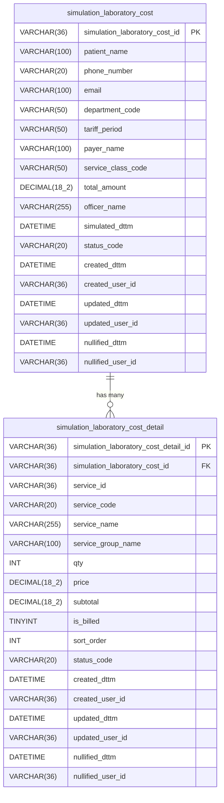
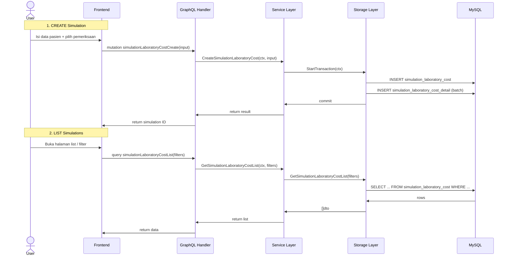

# Database Design: Simulasi Biaya Laboratorium

## Konteks

Berdasarkan analisis flow koding yang sudah ada di project HIS v3 (dari backend ke frontend), dokumen ini mendefinisikan struktur tabel database untuk menyimpan hasil simulasi biaya laboratorium.

### Konvensi yang Diikuti

| Konvensi | Sumber Referensi |
|---|---|
| UUID sebagai Primary Key (`VARCHAR(36)`) | `sample`, `general_sales`, semua tabel HIS v3 |
| Soft-delete via `status_code` (`normal` / `nullified`) | [meta.go](file:///c:/Users/Dipha/OneDrive/Documents/GitHub/hisv3/his-go-modules/pkg/dto/meta.go) |
| Audit trail: `created_dttm`, `created_user_id`, `updated_*`, `nullified_*` | [sample_gen.go](file:///c:/Users/Dipha/OneDrive/Documents/GitHub/hisv3/his-backend/internal/storage/laboratory/sample_gen.go) |
| Header-Detail pattern (1:N) | `general_sales` → `general_sales_item` |
| Naming: `snake_case`, tabel singular | Seluruh tabel di project |

---

## ER Diagram



---

## Tabel 1: `simulation_laboratory_cost` (Header)

Menyimpan data header simulasi biaya, termasuk identitas pasien dan parameter filter yang digunakan saat simulasi dibuat.

> [!NOTE]
> Tabel ini sesuai dengan data yang dikumpulkan di halaman [simulation-laboratory-cost-page.tsx](file:///c:/Users/Dipha/OneDrive/Documents/GitHub/hisv3/his-frontend/src/pages/laboratory/simulation-laboratory-cost-page.tsx) (List) dan dialog [dialog-add-simulation-laboratory-cost.tsx](file:///c:/Users/Dipha/OneDrive/Documents/GitHub/hisv3/his-frontend/src/pages/laboratory/components/dialog-add-simulation-laboratory-cost.tsx) (Form Input).

| Column | Type | Nullable | Default | Keterangan |
|---|---|---|---|---|
| `simulation_laboratory_cost_id` | `VARCHAR(36)` | NO | — | **PK**, UUID v4 |
| `patient_name` | `VARCHAR(100)` | NO | — | Nama pasien (dari dialog input) |
| `phone_number` | `VARCHAR(20)` | YES | `NULL` | Nomor telepon pasien |
| `email` | `VARCHAR(100)` | YES | `NULL` | Email pasien |
| `department_code` | `VARCHAR(50)` | NO | `'laboratorium'` | Kode departemen: `laboratorium`, `patologi-anatomi` |
| `tariff_period` | `VARCHAR(50)` | NO | — | Periode tarif saat simulasi (e.g. `2025`) |
| `payer_name` | `VARCHAR(100)` | NO | — | Penjamin: `Umum`, `BPJS`, dsb |
| `service_class_code` | `VARCHAR(50)` | NO | — | Kelas: `Kelas I`, `Kelas II`, dsb |
| `total_amount` | `DECIMAL(18,2)` | NO | `0` | Total biaya hasil simulasi |
| `officer_name` | `VARCHAR(255)` | YES | `NULL` | Nama petugas yang menjalankan simulasi |
| `simulated_dttm` | `DATETIME` | NO | `CURRENT_TIMESTAMP` | Tanggal & waktu simulasi dijalankan |
| `status_code` | `VARCHAR(20)` | NO | `'normal'` | Soft-delete: `normal` / `nullified` |
| `created_dttm` | `DATETIME` | NO | `CURRENT_TIMESTAMP` | Waktu record dibuat |
| `created_user_id` | `VARCHAR(36)` | NO | — | User ID pembuat |
| `updated_dttm` | `DATETIME` | YES | `NULL` | Waktu record diupdate |
| `updated_user_id` | `VARCHAR(36)` | YES | `NULL` | User ID yang update |
| `nullified_dttm` | `DATETIME` | YES | `NULL` | Waktu record dihapus (soft) |
| `nullified_user_id` | `VARCHAR(36)` | YES | `NULL` | User ID yang menghapus |

---

## Tabel 2: `simulation_laboratory_cost_detail` (Detail)

Menyimpan item-item pemeriksaan yang dipilih dalam satu simulasi.

> [!NOTE]
> Tabel ini sesuai dengan data yang ditampilkan di tabel pemeriksaan pada halaman [simulation-laboratory-cost-create-page.tsx](file:///c:/Users/Dipha/OneDrive/Documents/GitHub/hisv3/his-frontend/src/pages/laboratory/simulation-laboratory-cost-create-page.tsx) dan data dari model [add-simulation-data.ts](file:///c:/Users/Dipha/OneDrive/Documents/GitHub/hisv3/his-frontend/src/pages/laboratory/model/add-simulation-data.ts).

| Column | Type | Nullable | Default | Keterangan |
|---|---|---|---|---|
| `simulation_laboratory_cost_detail_id` | `VARCHAR(36)` | NO | — | **PK**, UUID v4 |
| `simulation_laboratory_cost_id` | `VARCHAR(36)` | NO | — | **FK** → `simulation_laboratory_cost` |
| `service_id` | `VARCHAR(36)` | YES | `NULL` | FK referensi ke `service_2.service_id` (opsional) |
| `service_code` | `VARCHAR(20)` | NO | — | Kode pemeriksaan (e.g. `H1001`) |
| `service_name` | `VARCHAR(255)` | NO | — | Nama pemeriksaan (e.g. `APTT`) |
| `service_group_name` | `VARCHAR(100)` | YES | `NULL` | Nama grup (e.g. `Hematologi`, `FUNGSI HATI`) |
| `qty` | `INT` | NO | `1` | Jumlah pemeriksaan |
| `price` | `DECIMAL(18,2)` | NO | `0` | Harga satuan |
| `subtotal` | `DECIMAL(18,2)` | NO | `0` | Harga × qty |
| `is_billed` | `TINYINT(1)` | NO | `1` | Apakah ditagihkan (checkbox "Tagihkan") |
| `sort_order` | `INT` | NO | `0` | Urutan tampil di tabel |
| `status_code` | `VARCHAR(20)` | NO | `'normal'` | Soft-delete |
| `created_dttm` | `DATETIME` | NO | `CURRENT_TIMESTAMP` | Waktu record dibuat |
| `created_user_id` | `VARCHAR(36)` | NO | — | User ID pembuat |
| `updated_dttm` | `DATETIME` | YES | `NULL` | Waktu record diupdate |
| `updated_user_id` | `VARCHAR(36)` | YES | `NULL` | User ID yang update |
| `nullified_dttm` | `DATETIME` | YES | `NULL` | Waktu dihapus |
| `nullified_user_id` | `VARCHAR(36)` | YES | `NULL` | User ID yang menghapus |

---

## DDL (MySQL)

```sql
-- =============================================
-- Tabel Header: simulation_laboratory_cost
-- =============================================
CREATE TABLE `simulation_laboratory_cost` (
  `simulation_laboratory_cost_id`   VARCHAR(36)     NOT NULL,
  `patient_name`                    VARCHAR(100)    NOT NULL,
  `phone_number`                    VARCHAR(20)     DEFAULT NULL,
  `email`                           VARCHAR(100)    DEFAULT NULL,
  `department_code`                 VARCHAR(50)     NOT NULL DEFAULT 'laboratorium',
  `tariff_period`                   VARCHAR(50)     NOT NULL,
  `payer_name`                      VARCHAR(100)    NOT NULL,
  `service_class_code`              VARCHAR(50)     NOT NULL,
  `total_amount`                    DECIMAL(18,2)   NOT NULL DEFAULT 0,
  `officer_name`                    VARCHAR(255)    DEFAULT NULL,
  `simulated_dttm`                  DATETIME        NOT NULL DEFAULT CURRENT_TIMESTAMP,
  `status_code`                     VARCHAR(20)     NOT NULL DEFAULT 'normal',
  `created_dttm`                    DATETIME        NOT NULL DEFAULT CURRENT_TIMESTAMP,
  `created_user_id`                 VARCHAR(36)     NOT NULL,
  `updated_dttm`                    DATETIME        DEFAULT NULL,
  `updated_user_id`                 VARCHAR(36)     DEFAULT NULL,
  `nullified_dttm`                  DATETIME        DEFAULT NULL,
  `nullified_user_id`               VARCHAR(36)     DEFAULT NULL,
  PRIMARY KEY (`simulation_laboratory_cost_id`),
  INDEX `idx_slc_status` (`status_code`),
  INDEX `idx_slc_simulated_dttm` (`simulated_dttm`),
  INDEX `idx_slc_patient_name` (`patient_name`)
) ENGINE=InnoDB DEFAULT CHARSET=utf8mb4 COLLATE=utf8mb4_unicode_ci;

-- =============================================
-- Tabel Detail: simulation_laboratory_cost_detail
-- =============================================
CREATE TABLE `simulation_laboratory_cost_detail` (
  `simulation_laboratory_cost_detail_id`  VARCHAR(36)     NOT NULL,
  `simulation_laboratory_cost_id`         VARCHAR(36)     NOT NULL,
  `service_id`                            VARCHAR(36)     DEFAULT NULL,
  `service_code`                          VARCHAR(20)     NOT NULL,
  `service_name`                          VARCHAR(255)    NOT NULL,
  `service_group_name`                    VARCHAR(100)    DEFAULT NULL,
  `qty`                                   INT             NOT NULL DEFAULT 1,
  `price`                                 DECIMAL(18,2)   NOT NULL DEFAULT 0,
  `subtotal`                              DECIMAL(18,2)   NOT NULL DEFAULT 0,
  `is_billed`                             TINYINT(1)      NOT NULL DEFAULT 1,
  `sort_order`                            INT             NOT NULL DEFAULT 0,
  `status_code`                           VARCHAR(20)     NOT NULL DEFAULT 'normal',
  `created_dttm`                          DATETIME        NOT NULL DEFAULT CURRENT_TIMESTAMP,
  `created_user_id`                       VARCHAR(36)     NOT NULL,
  `updated_dttm`                          DATETIME        DEFAULT NULL,
  `updated_user_id`                       VARCHAR(36)     DEFAULT NULL,
  `nullified_dttm`                        DATETIME        DEFAULT NULL,
  `nullified_user_id`                     VARCHAR(36)     DEFAULT NULL,
  PRIMARY KEY (`simulation_laboratory_cost_detail_id`),
  INDEX `idx_slcd_header` (`simulation_laboratory_cost_id`),
  INDEX `idx_slcd_service` (`service_id`),
  INDEX `idx_slcd_status` (`status_code`),
  CONSTRAINT `fk_slcd_header`
    FOREIGN KEY (`simulation_laboratory_cost_id`)
    REFERENCES `simulation_laboratory_cost` (`simulation_laboratory_cost_id`)
    ON DELETE CASCADE ON UPDATE CASCADE
) ENGINE=InnoDB DEFAULT CHARSET=utf8mb4 COLLATE=utf8mb4_unicode_ci;
```

---

## Mapping: Frontend ↔ Database

### Halaman List (`simulation-laboratory-cost-page.tsx`)

| Kolom Tabel Frontend | Source Column |
|---|---|
| No | ROW_NUMBER (computed) |
| Tgl Simulasi | `simulation_laboratory_cost.simulated_dttm` |
| Nama Pasien | `simulation_laboratory_cost.patient_name` |
| Nomor Telepon | `simulation_laboratory_cost.phone_number` |
| Email | `simulation_laboratory_cost.email` |
| Nama Petugas | `simulation_laboratory_cost.officer_name` |

### Halaman Create (`simulation-laboratory-cost-create-page.tsx`)

| UI Element | Source Column |
|---|---|
| Departemen (radio button) | `simulation_laboratory_cost.department_code` |
| Periode Tarif (dropdown) | `simulation_laboratory_cost.tariff_period` |
| Penjamin (dropdown) | `simulation_laboratory_cost.payer_name` |
| Kelas (dropdown) | `simulation_laboratory_cost.service_class_code` |
| Tabel: Kode | `simulation_laboratory_cost_detail.service_code` |
| Tabel: Nama Pemeriksaan | `simulation_laboratory_cost_detail.service_name` |
| Tabel: Qty | `simulation_laboratory_cost_detail.qty` |
| Tabel: Harga | `simulation_laboratory_cost_detail.price` |
| Tabel: Subtotal | `simulation_laboratory_cost_detail.subtotal` |
| Tabel: Tagihkan | `simulation_laboratory_cost_detail.is_billed` |
| Total | `simulation_laboratory_cost.total_amount` |

### Dialog Input (`dialog-add-simulation-laboratory-cost.tsx`)

| Field Dialog | Source Column |
|---|---|
| Nama Pasien | `simulation_laboratory_cost.patient_name` |
| Nomor Telephone | `simulation_laboratory_cost.phone_number` |
| Email | `simulation_laboratory_cost.email` |

---

## Alur Data (Flow)



---

## Catatan Implementasi

> [!IMPORTANT]
> - `service_id` pada tabel detail bersifat **opsional** (`NULL`-able). Ini karena petugas bisa menambahkan item kustom yang tidak terdaftar di master `service_2`.
> - `price` harus diambil dari tarif aktif sesuai `tariff_period`, `payer_name`, dan `service_class_code` saat simulasi dibuat — bukan di-hardcode.
> - `total_amount` di header merupakan **SUM dari subtotal** semua detail yang `is_billed = 1`.
> - `officer_name` diisi otomatis dari user yang sedang login (dari JWT token).

> [!TIP]
> Untuk implementasi di backend, ikuti pola yang ada di `internal/storage/laboratory/`:
> 1. Buat file `simulationcost.go` (custom query) dan `simulationcost_gen.go` (generated CRUD) di storage.
> 2. Buat DTO di `his-go-modules/pkg/dto/laboratory/`.
> 3. Buat service method di `internal/service/laboratory/`.
> 4. Definisikan GraphQL schema di `his-go-modules/pkg/graph/laboratory/graphqls/` dan generate resolver.
