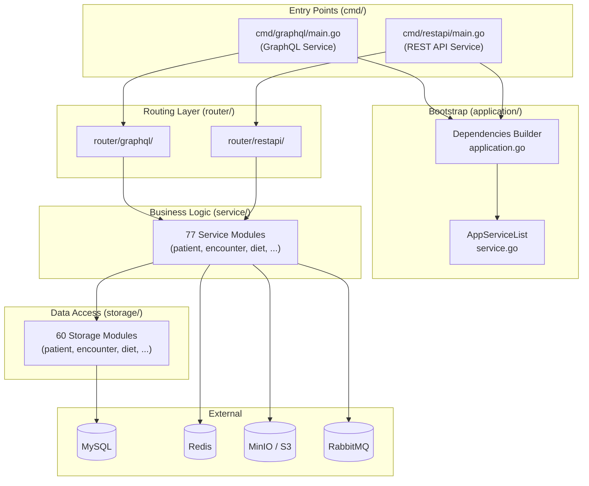
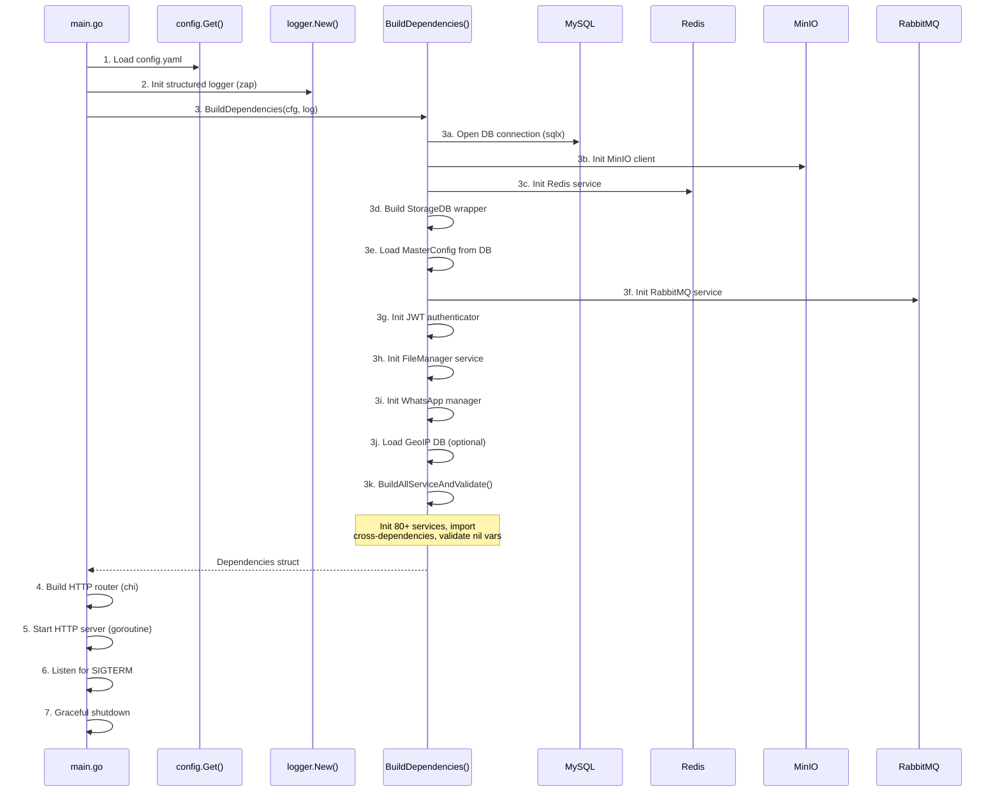
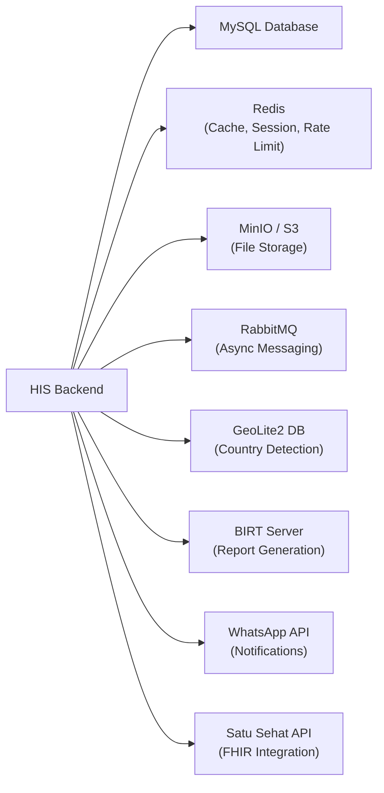
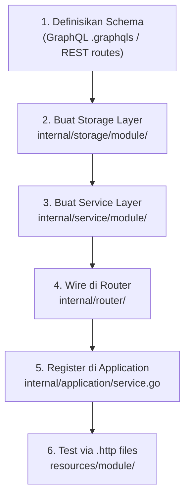

# Dokumentasi Arsitektur & Alur Pengkodingan — HIS Backend

> **Project**: `his-backend` — Hospital Information System (HIS) v3 Backend  
> **Bahasa**: Go 1.23  
> **Database**: MySQL (via sqlx)  
> **API Transport**: GraphQL (gqlgen) + REST API (chi router)  
> **Message Queue**: RabbitMQ  

---

## 1. Gambaran Umum Arsitektur

Sistem HIS Backend menggunakan **Layered Architecture** (arsitektur berlapis) dengan pola **Dependency Injection** melalui struct komposisi. Terdapat **dua entry point** utama yang masing-masing menjadi binary terpisah:



---

## 2. Struktur Folder Proyek

```
his-backend/
├── cmd/                          # Entry points (binary targets)
│   ├── graphql/main.go           #   → GraphQL server
│   ├── restapi/main.go           #   → REST API server
│   └── ... (61 utility/scripts)  #   → Alat bantu, migration, dll.
│
├── internal/                     # Core application code
│   ├── application/              #   → Bootstrap & dependency wiring
│   │   ├── application.go        #     Dependencies struct + builder
│   │   ├── service.go            #     AppServiceList + service init (~1148 baris)
│   │   ├── storage.go            #     Storage builder
│   │   ├── database.go           #     DB connection builder
│   │   ├── auth.go               #     JWT auth builder
│   │   ├── minio.go              #     MinIO client builder
│   │   ├── redis.go              #     Redis client builder
│   │   └── utils.go              #     Nil-variable validator
│   │
│   ├── router/                   #   → HTTP routing layer
│   │   ├── graphql/              #     GraphQL routes (44 modules)
│   │   ├── graphqleyeq/          #     EyeQ-specific GraphQL
│   │   ├── restapi/              #     REST API routes (29 modules)
│   │   ├── servicestatus/        #     Health-check endpoint
│   │   └── utils/                #     Response helpers
│   │
│   ├── service/                  #   → Business logic layer (77 modules)
│   │   ├── auth/
│   │   ├── patient/
│   │   ├── encounter/
│   │   ├── diet/
│   │   ├── pharmacy/
│   │   ├── inventory/
│   │   └── ... (77 sub-modules)
│   │
│   ├── storage/                  #   → Data access layer (60 modules)
│   │   ├── storage.go            #     DB connection function
│   │   ├── patient/
│   │   ├── encounter/
│   │   ├── diet/
│   │   └── ... (60 sub-modules)
│   │
│   ├── dto/                      #   → Data Transfer Objects
│   ├── enum/                     #   → Enumerations (buildmode, etc.)
│   └── middleware/               #   → Custom middleware (minimal)
│
├── pkg/                          # Shared utilities
│   ├── service/                  #   Shared service utilities
│   ├── storage/                  #   Shared storage utilities
│   └── utils/                    #   Common utility functions
│
├── config/                       # RBAC model config (casbin)
├── sql/                          # Sample SQL migration files
├── docs/                         # Swagger docs (auto-generated)
├── resources/                    # .http test files (per-module)
├── _compose/                     # Docker compose for local dev
│
├── config.yaml                   # Active config file
├── config-template.yaml          # Config template
├── gqlgen.yaml                   # GraphQL code-gen config
├── go.mod / go.sum               # Go module definitions
├── Dockerfile                    # GraphQL Docker image
├── Dockerfile-rest               # REST API Docker image
├── Dockerfile-rest-vendorservice # Vendor service Docker image
└── build.sh                      # Build script (docker build)
```

---

## 3. Alur Startup Aplikasi

Berikut adalah langkah-langkah yang terjadi saat aplikasi dijalankan, digunakan oleh **kedua** entry point (GraphQL & REST):



### 3.1. Detail `BuildDependencies()`

File: [application.go](file:///c:/Users/Dipha/OneDrive/Documents/GitHub/hisv3/his-backend/internal/application/application.go)

Fungsi `BuildDependencies()` melakukan:

1. **Generate Service ID** — UUID unik untuk setiap instance
2. **Open DB Connection** — MySQL via `sqlx`
3. **Build HTTP Client** — with TLS config
4. **Build MinIO Client** — object storage (S3-compatible)
5. **Build Redis Service** — caching & session
6. **Build StorageDB** — wrapper `mysqldb.Storage` (timeout, timezone, validation)
7. **Load MasterConfig** — konfigurasi rumah sakit dari database
8. **Init RabbitMQ** — publisher + subscriber
9. **Init JWT Auth** — token authentication
10. **Init FileManager** — file upload/download (MinIO)
11. **Init WhatsApp Manager** — notifikasi WhatsApp
12. **Load GeoIP** — optional country detection
13. **Build All Services** — 80+ service dengan dependency injection
14. **Return Dependencies struct** — digunakan oleh router

### 3.2. Detail `BuildAllServiceAndValidate()`

File: [service.go](file:///c:/Users/Dipha/OneDrive/Documents/GitHub/hisv3/his-backend/internal/application/service.go)

Proses inisialisasi service dibagi menjadi **2 fase**:

| Fase | Deskripsi |
|------|-----------|
| **Fase 1: Konstruksi** | Semua `NewService(...)` dipanggil secara berurutan |
| **Fase 2: Import Deps** | `importDepsForXxxService(...)` inject cross-dependencies |

> [!IMPORTANT]
> Fase 2 diperlukan karena adanya **circular dependency** antar service. Service A bergantung pada Service B dan sebaliknya. Pattern `Import*Service()` memecahkan masalah ini.

Setelah kedua fase selesai, `validateImportedService()` memeriksa semua field di setiap service. Jika ditemukan field **nil**, sistem akan **fatal exit**.

---

## 4. Layer Architecture — Penjelasan Detail

### 4.1. Layer 1: Router / Handler

**Lokasi**: `internal/router/`

Router di proyek ini berfungsi sebagai **handler** sekaligus **router**. Terdapat **dua jenis** transport:

#### A. GraphQL Router

```
internal/router/graphql/
├── graphql.go          → Middleware pipeline (JWT, rate limiter, session)
├── router.go           → Chi router + CORS setup  
├── v1.go               → Mount 44+ GraphQL sub-routes
├── diet/diet.go        → Per-module GraphQL handler
├── patient/...
├── encounter/...
└── ...
```

**Alur GraphQL Request**:
```
Client → Chi Router → CORS → CaptureBody → RequestMetadata → GraphQueryReader 
  → RateLimiter → Timeout → JWTVerifier → Authenticator → SessionCtx 
  → JWTClaims → gqlgen Handler → Resolver → Service → Storage → DB
```

Setiap modul GraphQL memiliki:
- **Resolver** — auto-generated oleh `gqlgen`, memanggil service
- **Schema** — `.graphqls` file mendefinisikan query/mutation
- **Handler** — `playground.Handler` + `handler.New` untuk endpoint GraphQL

#### B. REST API Router

```
internal/router/restapi/
├── restapi.go          → Middleware pipeline (timeout only)
├── router.go           → Chi router + CORS + panic recovery  
├── v1.go               → Mount 20+ REST sub-routes
├── auth/auth.go        → Per-module handler
├── patient/...
└── ...
```

**Alur REST Request**:
```
Client → Chi Router → Logger → PanicRecovery → CORS → Timeout 
  → Handler func → Service → Storage → DB
```

> [!NOTE]
> REST API memiliki middleware pipeline yang **lebih ringan** dibandingkan GraphQL. REST digunakan untuk komunikasi **BE-to-BE** (backend-to-backend), sedangkan GraphQL digunakan untuk komunikasi dengan **frontend**.

### Contoh REST Handler Pattern

```go
// File: internal/router/restapi/auth/auth.go
type handler struct {
    log     *logger.Logger
    authSvc *auth.Service
}

func Handler(log *logger.Logger, corsCfg config.Cors, 
    appService *application.AppServiceList) http.Handler {
    
    r := chi.NewRouter()
    r.Use(cors.Handler(...))
    
    controller := handler{log: log, authSvc: appService.AuthSvc}
    r.Route("/", func(r chi.Router) {
        r.HandleFunc("/login", controller.postAuth())
    })
    return r
}
```

### Contoh GraphQL Handler Pattern

```go
// File: internal/router/graphql/diet/diet.go
func BuildRouter(deps *application.Dependencies) http.Handler {
    r := chi.NewRouter()
    
    resolver := graph.NewResolver(deps.Log, deps.AppServiceList.DietSvc, ...)
    server := handler.New(generated.NewExecutableSchema(generated.Config{
        Resolvers: resolver,
    }))
    
    r.Handle("/", playground.Handler("GraphQL playground", ...))
    r.Handle("/query", server)
    return r
}
```

---

### 4.2. Layer 2: Service (Business Logic)

**Lokasi**: `internal/service/`

Setiap service memiliki struktur yang konsisten:

```
internal/service/<module>/
├── <module>.go          → Service struct + constructor + business methods
├── storageinterface.go  → Interface untuk storage dependency
├── importservice.go     → Import<X>Service() methods (cross-dep injection)
└── ... (feature files)
```

#### Service Struct Pattern

```go
type Service struct {
    log              loginterface.Interface
    storage          storage           // interface ke storage layer
    timezone         string
    encounterService encounterService  // cross-dependency (interface)
    PatientService   PatientService    // cross-dependency (interface)
    svcID            string
    rabbitMQRoute    string
    rabbitMQExchange string
}

func NewService(storageDB *mysqldb.Storage, ...) *Service {
    return &Service{
        log:     storageDB.Log,
        storage: dietstorage.NewStorage(storageDB),
        ...
    }
}
```

#### Key Design Decisions

| Pattern | Penjelasan |
|---------|-----------|
| **Interface-based dependencies** | Setiap service mendefinisikan interface lokal untuk dependency, bukan coupling ke struct konkret |
| **Import pattern** | Method `Import<X>Service()` digunakan untuk inject cross-dependency setelah konstruksi |
| **Transaction management** | Service menggunakan `storage.StartTransaction()` + `defer storage.FinishTransaction()` |
| **Error logging** | Error di-log via `svc.log.ErrorService()` dengan filename, line, function info |
| **Structured logging** | Menggunakan `zap.Field` untuk context-rich logging |

#### Contoh Business Logic

```go
func (svc *Service) CreatePatientDietCompact(data *model.DietCompactInput, 
    encounterID, userID string) (*dietdto.EncounterDiet, error) {
    
    // 1. Validasi encounter
    enc, err := svc.encounterService.GetEncounterCompactOne(encounterID)
    if err != nil { return nil, err }
    
    // 2. Ambil data pasien
    patient, err := svc.PatientService.GetSimpleByID(enc.PatientID)
    if err != nil { return nil, err }
    
    // 3. Serialize data JSON
    var dietChange strings.Builder
    json.NewEncoder(&dietChange).Encode(data.DietChange)
    
    // 4. Build domain object
    encounterDiet := &dietdto.EncounterDiet{...}
    
    // 5. Start transaction
    ctx := svc.storage.StartTransaction(context.Background(), 
        mysqldb.TransactionModeBuffered, ServiceDiet, "CreatePatientDietCompact")
    defer svc.storage.FinishTransaction(ctx, &err)
    
    // 6. Insert data
    err = svc.storage.InsertEncounterDietData(ctx, encounterDiet)
    err = svc.storage.InsertEncounterDietChangelogData(ctx, dietChangelog)
    
    // 7. Send notification
    err = svc.SendDietChangeNotification(...)
    
    return encounterDiet, nil
}
```

---

### 4.3. Layer 3: Storage (Data Access)

**Lokasi**: `internal/storage/`

Storage layer bertanggung jawab untuk semua interaksi database. Menggunakan **embedded struct** dari `mysqldb.Storage` yang menyediakan helper functions.

```
internal/storage/<module>/
├── storage.go           → Package declaration
├── <table>.go           → Manual query implementations
├── <table>_gen.go       → Auto-generated CRUD (golang-crud-generator)
└── ... (additional tables)
```

#### Storage Struct Pattern

```go
type Storage struct {
    *mysqlx.Storage  // embedded, provides all DB helpers
}

func NewStorage(storageDb *mysqldb.Storage) *Storage {
    return &Storage{Storage: storageDb}
}
```

#### Generated Code (`_gen.go`)

File `*_gen.go` di-generate oleh tool internal `golang-crud-generator`. File ini menyediakan:

| Function | Deskripsi |
|----------|-----------|
| `BuildEncounterDietFields(alias)` | SELECT column list builder |
| `NewEncounterDietRecord(obj)` | DTO → `map[string]interface{}` converter |
| `(rec).ToService()` | DB struct → DTO converter |
| `BuildInsertEncounterDietQuery(obj)` | INSERT statement builder |
| `BuildUpdateEncounterDietQuery(obj)` | UPDATE statement builder |
| `BuildDeleteEncounterDietQuery(obj)` | Hard DELETE statement builder |
| `BuildSoftDeleteEncounterDietQuery(obj)` | Soft DELETE (nullified) statement builder |

> [!CAUTION]
> File `*_gen.go` **TIDAK BOLEH** diedit manual! Regenerate jika perlu perubahan, atau hapus suffix `_gen` untuk membuat perubahan manual.

#### Manual Storage Methods

```go
func (store *Storage) GetEncounterDietDataByID(encounterDietID string) (*dietdto.EncounterDiet, error) {
    querySt := `SELECT ` + BuildEncounterDietFields("ed") + `
        FROM encounter_diet ed
        WHERE ed.encounter_diet_id = :encounter_diet_id`

    args := map[string]interface{}{
        "encounter_diet_id": encounterDietID,
    }

    row, err := store.QueryRowxContext(TableEncounterDiet, "GetEncounterDietDataByID", querySt, args)
    if err != nil { return nil, store.ErrorQueryRowxContext(err) }
    defer row.Cancel()

    var rslt EncounterDiet
    err = store.RowStructScan(row, &rslt, ...)
    if errors.Is(err, sql.ErrNoRows) { return nil, nil }
    if err != nil { return nil, row.ErrorStructScan(err) }

    return rslt.ToService(), nil
}
```

#### Pola Umum Storage

| Pattern | Contoh |
|---------|--------|
| **Named parameters** | `:encounter_diet_id` |
| **QueryxContext (multi-row)** | `store.QueryxContext(table, funcName, query, args)` |
| **QueryRowxContext (single-row)** | `store.QueryRowxContext(table, funcName, query, args)` |
| **NamedExec (write)** | `tx.NamedExec(table, funcName, queryArgs)` |
| **Transaction** | `store.GetTransaction(ctx)` → `tx.NamedExec(...)` |
| **Struct scanning** | `store.RowsStructScan()` / `store.RowStructScan()` |
| **Error handling** | `store.ErrorQueryxContext(err)` wrappers |

---

## 5. Data Transfer Objects (DTO)

DTO berada di **dua lokasi**:

| Lokasi | Deskripsi |
|--------|-----------|
| `internal/dto/` | DTO internal proyek (minimal) |
| `his-go-modules/pkg/dto/` | DTO shared via Go modules (mayoritas) |

Domain objects (DTO) digunakan untuk **dekouple** antara storage struct (dengan `db:` tags dan `sql.Null*` types) dan service/business objects. Konversi dilakukan via method `ToService()` pada storage struct.

---

## 6. External Dependencies & Infrastructure

### 6.1. Shared Go Modules

| Module | Fungsi |
|--------|--------|
| `common-go-modules` | Config, logger, middleware, JWT, Redis, MySQL, RabbitMQ, MinIO, dll. |
| `his-go-modules` | DTO, GraphQL schemas, enums, models khusus HIS |
| `golang-fhir-models` | FHIR data models |

### 6.2. Infrastructure Services



### 6.3. Konfigurasi

File konfigurasi: `config.yaml` (dari template `config-template.yaml`)

Sections utama:

| Section | Isi |
|---------|-----|
| `general` | buildMode, timezone, pprof |
| `http` | address, port, timeout, rate limit |
| `cors` | allowed origins/methods/headers |
| `jwtAuth` | secret, algorithm, expiry |
| `dbMySQL` | host, port, user, pass, dbName |
| `redis` | host, port, password |
| `minio` | endpoint, access key, bucket |
| `rabbitMq` | URI, exchange, publisher/subscriber |
| `paramsValidation` | field validation flags |
| `reportService` | BIRT URL, asset paths |

---

## 7. Alur Pengkodingan — Step-by-Step untuk Fitur Baru

### 7.1. Diagram Alur



### 7.2. Step 1: Definisikan Schema / Contract

**Untuk GraphQL:**
- Buat file `.graphqls` di `his-go-modules` (shared module)
- Jalankan `gqlgen generate` untuk membuat resolver skeleton
- Schema dan models di-generate ke `his-go-modules/pkg/graph/<module>/`

**Untuk REST API:**
- Definisikan routes di handler file
- Tambahkan Swagger annotations (@Summary, @Router, dll.)
- Swagger docs akan ter-generate ke `docs/`

### 7.3. Step 2: Buat Storage Layer

```
internal/storage/<module>/
├── storage.go         → package declaration
├── <table>.go         → query implementations
└── <table>_gen.go     → gunakan generator untuk CRUD dasar
```

**Checklist:**

- [ ] Buat `Storage` struct yang embed `*mysqlx.Storage`
- [ ] Buat constructor `NewStorage(storageDb *mysqldb.Storage) *Storage`
- [ ] Generate CRUD dasar via `golang-crud-generator`
- [ ] Tulis custom query functions yang dibutuhkan
- [ ] Gunakan `db:""` tags untuk struct field → column mapping
- [ ] Buat method `ToService()` untuk konversi ke DTO
- [ ] Selalu gunakan named parameters (`:param_name`)

### 7.4. Step 3: Buat Service Layer

```
internal/service/<module>/
├── <module>.go          → Service struct, NewService(), business logic
├── storageinterface.go  → storage interface definition
└── importservice.go     → Import<X>Service() for cross-dependencies
```

**Checklist:**

- [ ] Definisikan `storage` interface di `storageinterface.go`
- [ ] Definisikan interface untuk setiap cross-dependency
- [ ] Buat `Service` struct dengan field type interface
- [ ] Buat `NewService(...)` constructor
- [ ] Buat `Import<X>Service()` methods jika ada cross-dependency
- [ ] Implementasikan business logic methods
- [ ] Gunakan `svc.log.ErrorService(...)` untuk error logging
- [ ] Gunakan transaction untuk operasi multi-insert/update

### 7.5. Step 4: Wire di Router

**GraphQL:**
```go
// internal/router/graphql/<module>/<module>.go
func BuildRouter(deps *application.Dependencies) http.Handler {
    r := chi.NewRouter()
    resolver := graph.NewResolver(deps.Log, deps.AppServiceList.<Module>Svc, ...)
    server := handler.New(generated.NewExecutableSchema(generated.Config{
        Resolvers: resolver,
    }))
    r.Handle("/", playground.Handler("GraphQL playground", ...))
    r.Handle("/query", server)
    return r
}
```

Tambahkan mount di `internal/router/graphql/v1.go`:
```go
r.Mount(modulegraph.BaseRoute, modulegraph.BuildRouter(deps))
```

**REST API:**
```go
// internal/router/restapi/<module>/<module>.go
func Handler(log *logger.Logger, corsCfg config.Cors, 
    appService *application.AppServiceList) http.Handler {
    r := chi.NewRouter()
    r.Use(cors.Handler(...))
    controller := handler{svc: appService.<Module>Svc}
    r.Route("/", func(r chi.Router) {
        r.Get("/", controller.list())
        r.Post("/", controller.create())
    })
    return r
}
```

Tambahkan mount di `internal/router/restapi/v1.go`:
```go
r.Mount("/modules", modulehandler.Handler(deps.Log, deps.Cfg.Cors, deps.AppServiceList))
```

### 7.6. Step 5: Register di Application

Di `internal/application/service.go`:

1. **Import package** service baru:
   ```go
   modulesvc "github.com/developersismedika/his-backend/internal/service/module"
   ```

2. **Tambah field** di `AppServiceList`:
   ```go
   ModuleSvc *modulesvc.Service
   ```

3. **Inisialisasi** di `BuildAllServiceAndValidate()`:
   ```go
   svc.ModuleSvc = modulesvc.NewService(storageDB, ...)
   ```

4. **Import cross-deps** (jika ada):
   ```go
   svc.importDepsForModuleService()
   ```

5. **Validasi** di `utils.go`:
   ```go
   svc.totalServiceWithNilVars += svc.getAndPrintAllNilVariables(svc.ModuleSvc, "ModuleSvc")
   ```

### 7.7. Step 6: Testing

- Buat `.http` file di `resources/<module>/`
- Gunakan REST Client extension di VS Code
- Jalankan request langsung ke server dev

---

## 8. Cross-Cutting Concerns

### 8.1. Authentication & Authorization

| Mekanisme | Transport | Deskripsi |
|-----------|-----------|-----------|
| **JWT (Bearer)** | GraphQL | Token di header `Authorization: Bearer <token>` |
| **RBAC (Casbin)** | GraphQL | Role-based access via `enforcer` |
| **API Key** | REST | Untuk BE-to-BE communication |

### 8.2. Middleware Pipeline

**GraphQL Pipeline** (7 middleware layers):
1. `CaptureGraphQLRequestBody` — Capture body
2. `RequestMetadataMiddleware` — GeoIP, device info
3. `GraphQueryReader` — Parse function names
4. `GraphAccessRateLimiter` — Rate limiting
5. `Timeout` — Request timeout (504)
6. `JWTVerifier` → `Authenticator` — Auth chain
7. `SessionGraphQLCtx` + `JWTClaimsMiddleware` — Session

**REST Pipeline** (3 middleware layers):
1. `Logger` + `PanicRecovery` — Observability
2. `CORS` — Cross-origin configuration
3. `Timeout` — Request timeout

### 8.3. Message Queue (RabbitMQ)

Pattern publisher/subscriber digunakan untuk:
- **Notifikasi** — email, WhatsApp, push notification
- **Satu Sehat** — integrasi FHIR ke platform nasional
- **Audio Consumer** — processing audio submissions
- **Data Consumer** — cross-service data sync
- **Virtual Printer** — printing via MQ

### 8.4. Error Handling

```go
// Storage layer: return wrapped error
return nil, store.ErrorQueryxContext(err)

// Service layer: log + return user-friendly error
filename, lineOfCode, functionName := loggingutil.GetCallerInfo(1)
args := []zap.Field{zap.String("patientID", patientID)}
svc.log.ErrorService(err.Error(), functionName, "ListDietByPatientID", filename, lineOfCode, args)
return nil, fmt.Errorf("gagal menarik informasi diet")

// Handler layer: return HTTP status code
w.WriteHeader(http.StatusBadRequest)
```

---

## 9. Build & Deployment

### 9.1. Docker Images

| Image | Dockerfile | Entry Point |
|-------|-----------|-------------|
| `sismedika/his-graphql` | `Dockerfile` | `cmd/graphql/main.go` |
| `sismedika/his-restapi` | `Dockerfile-rest` | `cmd/restapi/main.go` |
| `sismedika/his-restapi-vendorservice` | `Dockerfile-rest-vendorservice` | Vendor-specific REST |

### 9.2. Build Process

```bash
# Build via script
bash build.sh -a author -e email@example.com -v develop -m github.com -u user -t token

# Script melakukan:
# 1. Extract git commit hash + tag
# 2. Build GraphQL Docker image
# 3. Build REST API Docker image  
# 4. Build Vendor Service Docker image
# 5. Clean up dangling images
```

### 9.3. Build Flags (ldflags)

```bash
go build -o his-graphql \
    -ldflags "-X main.Version=$VERSION -X main.Tag=$TAG -X main.BuildTime=$BUILD_TIME" \
    ./cmd/graphql
```

Variabel build diinject ke `main.go`:
- `Version` — develop / staging / production
- `Tag` — Git tag (e.g., v0.0.1)
- `HashCommit` — Git commit hash
- `BuildTime` — Build timestamp

---

## 10. Ringkasan Pola & Konvensi

| Aspek | Konvensi |
|-------|----------|
| **Module naming** | `snake_case` for package, matching folder name |
| **Service constructor** | `NewService(storageDB, ...)` |
| **Storage constructor** | `NewStorage(storageDB)` |
| **Cross-dep injection** | `Import<X>Service(svc)` pattern |
| **Query parameters** | Named params: `:param_name` |
| **DB struct → DTO** | `ToService()` method |
| **DTO → DB args** | `NewXxxRecord(obj) map[string]interface{}` |
| **Transaction** | `StartTransaction()` + `defer FinishTransaction()` |
| **Error handling** | Storage wraps → Service logs + returns → Handler returns HTTP status | 
| **Generated code** | `*_gen.go` — DO NOT EDIT |
| **Config** | YAML via viper (through common-go-modules) |
| **Logging** | Structured (zap) via `ErrorService()` |
| **Testing** | `.http` files in `resources/` |
| **API Docs** | Swagger (REST), GraphQL Playground (GraphQL) |
