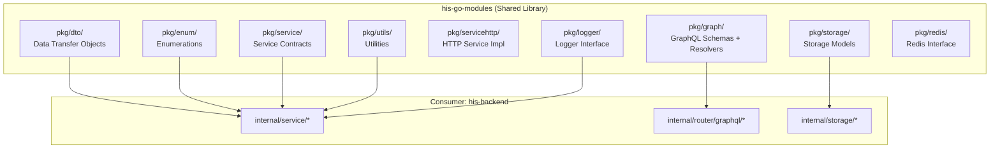
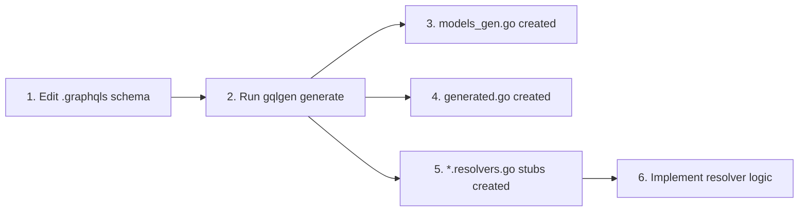
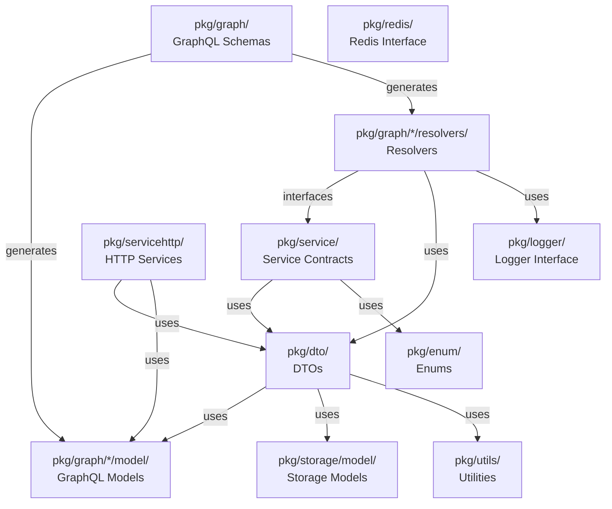
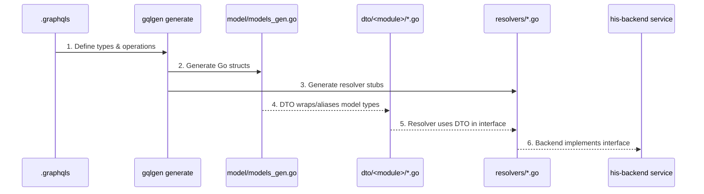
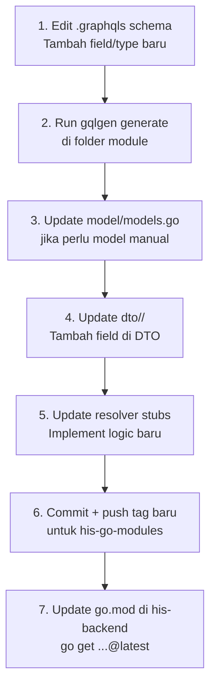

# Dokumentasi Arsitektur & Alur Pengkodingan — HIS Go Modules

> **Project**: `his-go-modules` — Shared Go Library untuk Ekosistem HIS v3  
> **Module**: `github.com/developersismedika/his-go-modules`  
> **Go Version**: 1.23  
> **Tipe**: **Library** (bukan executable, tidak memiliki `main.go`)

---

## 1. Apa Itu `his-go-modules`?

`his-go-modules` adalah **shared library** yang berisi semua definisi, kontrak, dan tipe data yang dipakai bersama oleh seluruh layanan di ekosistem HIS v3. Modul ini **bukan** aplikasi yang bisa dijalankan, melainkan dependency yang di-import oleh:

- `his-backend` (GraphQL + REST API server)
- Service-service lain di ekosistem HIS



> [!IMPORTANT]
> Modul ini **tidak memiliki business logic yang berjalan sendiri**. Ia hanya menyediakan **kontrak/interface**, **tipe data**, **schema GraphQL**, dan **utility functions** yang dikonsumsi oleh `his-backend` dan service lain.

---

## 2. Struktur Folder Proyek

```
his-go-modules/
├── pkg/                              # Semua kode utama
│   ├── dto/                          #   → Data Transfer Objects (62 modules)
│   │   ├── meta.go                   #     Base Meta struct (audit fields)
│   │   ├── patient/                  #     Patient DTOs (18 files)
│   │   ├── encounter/                #     Encounter DTOs (141 files!)
│   │   ├── diet/                     #     Diet DTOs (8 files)
│   │   ├── masterconfig/             #     MasterConfig DTOs (11 files)
│   │   └── ... (62 sub-modules)
│   │
│   ├── enum/                         #   → Enumerations & Constants (43 modules)
│   │   ├── common/                   #     Shared enums (gender, statuscode, days)
│   │   ├── encounter/                #     Encounter status, types (18 files)
│   │   ├── patient/                  #     Patient enums
│   │   └── ... (43 sub-modules)
│   │
│   ├── graph/                        #   → GraphQL Schemas + Code Gen (49 modules)
│   │   ├── diet/                     #     Diet GraphQL (schema, model, resolver)
│   │   ├── patient/                  #     Patient GraphQL
│   │   ├── encounter/                #     Encounter GraphQL
│   │   ├── graphtemplate/            #     Blank template for new modules
│   │   ├── generate.sh               #     gqlgen generate script
│   │   └── ... (49 sub-modules)
│   │
│   ├── grapheyeq/                    #   → EyeQ-specific GraphQL (7 modules)
│   │   ├── patientaction/
│   │   ├── visionprescription/
│   │   └── ...
│   │
│   ├── service/                      #   → Service Interfaces/Contracts (7 modules)
│   │   ├── patient/                  #     Patient service interface
│   │   ├── practitioner/             #     Practitioner service interface
│   │   └── ...
│   │
│   ├── servicehttp/                  #   → HTTP-based Service Impls (12 modules)
│   │   ├── patient/                  #     Patient via REST API
│   │   ├── payor/                    #     Payor via REST API
│   │   └── ...
│   │
│   ├── storage/                      #   → Storage/DB Models
│   │   └── model/
│   │       ├── meta.go               #     Storage-level Meta struct
│   │       └── model.go
│   │
│   ├── logger/                       #   → Logger Interface
│   │   └── logger.go                 #     Interface{} for zap logger
│   │
│   ├── redis/                        #   → Redis Interface
│   │   └── redis.go                  #     RedisService interface
│   │
│   └── utils/                        #   → Utility Functions
│       ├── utils.go                  #     Nullable helpers, math, time, dates
│       ├── concat.go                 #     List concatenation
│       ├── fatalerror.go             #     Fatal error handler
│       ├── image.go                  #     Image utilities
│       ├── common/                   #     Common helpers (email, date, string)
│       ├── marshaler/                #     Custom marshalers
│       ├── masterconfig/             #     MasterConfig helpers
│       └── sql/                      #     SQL utilities
│
├── sql/                              # SQL files (schemas, triggers, procedures)
│   ├── encounter/
│   ├── mysql_files/
│   ├── procedure_files/
│   ├── trigger_files/
│   └── _scripts/
│
├── _data/                            # Sample/reference data
├── go.mod / go.sum                   # Module definition
└── *.sh                              # Version/release scripts
```

---

## 3. Penjelasan Setiap Layer

### 3.1. `pkg/dto/` — Data Transfer Objects

**Tujuan**: Mendefinisikan struct Go yang menjadi **kontrak data** antara layer service dan storage di `his-backend`.

#### Meta Struct (Dasar)

Semua DTO yang memiliki audit trail menggunakan `Meta` struct:

```go
// pkg/dto/meta.go
type Meta struct {
    StatusCode  string     `json:"status_code"`
    CreatedAt   time.Time  `json:"created_dttm"`
    UpdatedAt   *time.Time `json:"updated_dttm"`
    NullifiedAt *time.Time `json:"nullified_dttm"`
    CreatedBy   string     `json:"created_user_id"`
    UpdatedBy   *string    `json:"updated_user_id"`
    NullifiedBy *string    `json:"nullified_user_id"`
}
```

#### DTO Pattern

Setiap module (misal `diet`) memiliki 2 jenis file:

| File | Deskripsi | Boleh Edit? |
|------|-----------|-------------|
| `diet.go` | **Manual DTO** — struct kustom + helper methods | ✅ Ya |
| `diet_gen.go` | **Generated DTO** — struct dasar via CRUD generator | ❌ Jangan! |

```go
// pkg/dto/diet/diet_gen.go (GENERATED)
type EncounterDiet struct {
    EncounterDietID   string    `json:"encounterDietID"`
    EncounterID       string    `json:"encounterID"`
    PatientID         string    `json:"patientID"`
    DietNote          string    `json:"dietNote"`
    IsFasting         bool      `json:"isFasting"`
    Meta              dtostorage.Meta `json:"meta"`
    Default_          []string         // columns using DB default
}
```

```go
// pkg/dto/diet/diet.go (MANUAL)
type DietCompact model.DietCompact

func (d *DietCompact) ToGraphModel() *model.DietCompact {
    return (*model.DietCompact)(d)
}
```

> [!TIP]
> Pattern `ToGraphModel()` digunakan untuk mengkonversi DTO ke tipe GraphQL model. Konversi dilakukan via **type alias** + **type casting**, bukan manual field copy.

#### Skala DTO

| Module | Jumlah File | Catatan |
|--------|-------------|---------|
| `encounter/` | **141 files** | Termasuk lab, radiology, hemodialysis, dll. |
| `patient/` | 18 files | Full CRUD + satu sehat |
| `diet/` | 8 files | Diet + screening + monev |
| `masterconfig/` | 11 files | Hospital config, inventory config, dll |
| Total | **62 sub-modules** | |

---

### 3.2. `pkg/enum/` — Enumerations & Constants

**Tujuan**: Menyediakan **konstanta tipe-aman** (type-safe constants) untuk value sets yang digunakan di seluruh sistem.

#### Contoh Modul Enum

```
pkg/enum/
├── common/
│   ├── gender/          → Male, Female
│   ├── statuscode/      → normal, nullified
│   └── days/            → Senin, Selasa, ...
├── encounter/
│   ├── status.go        → planned, arrived, onCare, discharged, finished, ...
│   ├── type.go          → outpatient, inpatient, emergency
│   └── ... (18 files)
├── patient/
├── inventory/
└── ... (43 sub-modules)
```

Enums digunakan di service layer untuk **validasi** dan **branching logic**, menghindari raw string comparison.

---

### 3.3. `pkg/graph/` — GraphQL Schemas & Code Generation

**Tujuan**: Mendefinisikan **GraphQL API contract** dan menghasilkan kode Go secara otomatis menggunakan `gqlgen`.

#### Struktur Per-Module GraphQL

Setiap module di `pkg/graph/` memiliki struktur standar:

```
pkg/graph/<module>/
├── gqlgen.yaml          → Config untuk code generator
├── graphqls/            → Schema files (.graphqls)
│   ├── main.graphqls    → Base types (Meta, Pagination, CodeableConcept)
│   ├── <feature>.graphqls
│   └── <feature>input.graphqls
├── model/               → Go model structs
│   ├── models.go        → Manual models
│   └── models_gen.go    → Auto-generated from schema
├── resolvers/           → Resolver implementations
│   ├── resolver.go      → Resolver struct + dependency interfaces
│   ├── function.go      → Shared helper functions
│   └── *.resolvers.go   → Auto-generated resolver stubs
└── generated/
    └── generated.go     → gqlgen output (DO NOT EDIT)
```

#### Alur Code Generation



**Command:**
```bash
cd pkg/graph/<module>
go get github.com/99designs/gqlgen@v0.17.45
go run github.com/99designs/gqlgen generate
```

#### Resolver Pattern

Resolver menghubungkan GraphQL queries/mutations ke service layer via **interface-based dependency injection**:

```go
// pkg/graph/diet/resolvers/resolver.go

// Service interfaces (contracts)
type service interface {
    dietService
    dietCareService
    dietMonevService
    dietHistoryService
    dietScreeningService
    dietScreeningServiceMutation
}

type authService interface {
    ExtractSessionFromContext(ctx context.Context) (*sessiondto.Session, error)
}

// Resolver receives *interfaces*, not concrete types
type Resolver struct {
    service service
    authSvc authService
    log     logger.Interface
}

func NewResolver(log logger.Interface, service service, authSvc authService) *Resolver {
    return &Resolver{service: service, authSvc: authSvc, log: log}
}
```

> [!IMPORTANT]
> Resolver **hanya mendefinisikan interface**. Implementasi konkret diberikan oleh `his-backend` melalui service layer-nya. Ini memungkinkan modul GraphQL tetap decoupled dari implementasi spesifik.

#### GraphQL Schema Pattern

```graphql
# Base types (main.graphqls)
type CodeableConcept {
  codingSystem: String!
  codingCode: String!
  codingDisplay: String!
}

type PaginationInfoType {
  totalRow: Int!
  totalPage: Int!
  page: Int!
}

# Feature types (diet.graphqls)
type Query {
  patientDietList(...): PatientDietListResponse!
  patientDietDetailOne(encounterDietID: ID!): PatientDietDetailResponse!
}

type Mutation {
  createPatientDietCompact(input: DietCompactInput!, encounterID: ID!): dietCRUDResult!
  updatePatientDietCompact(input: DietCompactInput!, encounterDietID: ID!): dietCRUDResult!
}
```

#### Daftar Module GraphQL

| Module | Schema Files | Deskripsi |
|--------|-------------|-----------|
| `diet` | 10 files | Diet management, screening, monitoring |
| `encounter` | ~20+ files | Kunjungan pasien, lab, radiology |
| `patient` | ~10+ files | Pasien CRUD, riwayat |
| `pharmacy` | ~10+ files | Farmasi, resep obat |
| `inventory` | ~10+ files | Manajemen stok |
| ... | | **49 modules total** |

---

### 3.4. `pkg/grapheyeq/` — EyeQ GraphQL

Sub-set khusus untuk **EyeQ** (sistem mata/optik). Struktur identik dengan `pkg/graph/`, tetapi dipisah karena domain-specific:

| Module | Deskripsi |
|--------|-----------|
| `patientaction` | Tindakan pasien mata |
| `visionprescription` | Preskripsi kacamata/lensa |
| `encounterpec` | Encounter PEC (mata) |
| `inventory` | Inventori optik |
| `labrequestexternal` | Request lab eksternal |
| `medicationrequestexternal` | Request obat eksternal |
| `radiologyexternal` | Request radiologi eksternal |

---

### 3.5. `pkg/service/` — Service Contracts (Interfaces)

**Tujuan**: Mendefinisikan **service interface** yang bisa diimplementasikan secara berbeda tergantung konteks pemakaian.

```go
// pkg/service/patient/patient.go
type storage interface {
    GetByID(id string) (*patientdto.PatientResponse, error)
    GetByNIK(nik string) (*patientdto.PatientResponse, error)
    Insert(input patientdto.PatientInput) (*patientdto.PatientResponse, error)
    // ...
}

type Service struct {
    storage storage
}

func NewService(storage storage) *Service {
    return &Service{storage: storage}
}

func (svc *Service) GetPatient(identifierType, identifierValue string) (*patientdto.PatientResponse, error) {
    switch identifierType {
    case patientidentifiertype.ID:
        return svc.storage.GetByID(identifierValue)
    case patientidentifiertype.NIK:
        return svc.storage.GetByNIK(identifierValue)
    case patientidentifiertype.Passport:
        return svc.storage.GetByPassport(identifierValue)
    }
    return nil, fmt.Errorf("invalid patient identifier type: %s", identifierType)
}
```

#### Modul Service Tersedia

| Module | Deskripsi |
|--------|-----------|
| `patient` | Patient CRUD + lookup by NIK/Passport |
| `person` | Person data management |
| `practitioner` | Practitioner/doctor management |
| `healthcareservice` | Healthcare service lookups |
| `regional` | Regional data (provinsi, kota, dll) |
| `service` | Medical service management |
| `session` | Session management |

---

### 3.6. `pkg/servicehttp/` — HTTP-based Service Implementations

**Tujuan**: Implementasi service via **REST API call** (HTTP client) ke `his-backend` REST API. Digunakan oleh service lain yang perlu memanggil `his-backend` secara remote.

```go
// pkg/servicehttp/patient/patient.go
type hisApi interface {
    GetPatient(identifierType, identifierValue string) (*dto.PatientResponse, error)
    CreatePatient(input dto.PatientInput) (*dto.PatientResponse, error)
    GetPatientSatuSehat(name, birthdate, nik string) (*dto.PatientSatuSehatOne, error)
}

type Service struct {
    hisApi hisApi
}

func NewService(hisApi hisApi) *Service {
    return &Service{hisApi: hisApi}
}

// Implemented methods call HIS REST API
func (svc *Service) GetPatient(identifierType, identifierValue string) (*dto.PatientResponse, error) {
    return svc.hisApi.GetPatient(identifierType, identifierValue)
}

// Unimplemented methods return nil (stub pattern)
func (svc *Service) GetPatientFull(patientID string) (*dto.PatientFullDetail, error) {
    return nil, nil // NOT IMPLEMENTED for HTTP mode
}
```

> [!NOTE]
> Pola **stub** (return `nil, nil`) digunakan untuk method yang tidak relevan saat dipanggil via HTTP. Ini memungkinkan `servicehttp.Service` satisfies interface yang sama dengan `service.Service` tanpa memerlukan semua implementasi.

#### Modul ServiceHTTP Tersedia

| Module | Deskripsi |
|--------|-----------|
| `patient` | Patient via REST API |
| `payor` | Payor/asuransi via REST API |
| `payment` | Payment via REST API |
| `doctor` | Doctor lookup via REST API |
| `appointment` | Appointment via REST API |
| ... | **12 modules** |

---

### 3.7. `pkg/storage/model/` — Storage Models

**Tujuan**: Mendefinisikan `Meta` struct tingkat storage (tanpa `StatusCode`), digunakan untuk audit trail di database layer.

```go
// pkg/storage/model/meta.go
type Meta struct {
    CreatedAt   time.Time  `json:"created_dttm"`
    UpdatedAt   *time.Time `json:"updated_dttm"`
    NullifiedAt *time.Time `json:"nullified_dttm"`
    CreatedBy   string     `json:"created_user_id"`
    UpdatedBy   *string    `json:"updated_user_id"`
    NullifiedBy *string    `json:"nullified_user_id"`
}
```

> [!NOTE]
> Perbedaan `dto.Meta` vs `storage/model.Meta`:
> - `dto.Meta` menyertakan `StatusCode` — digunakan oleh service layer
> - `storage/model.Meta` **tanpa** `StatusCode` — digunakan di storage/DB layer

---

### 3.8. `pkg/logger/` — Logger Interface

Mendefinisikan logger contract yang **mirror** dari `common-go-modules/pkg/logger`:

```go
type Interface interface {
    Notice(msg string, field ...zap.Field)
    Info(msg string, field ...zap.Field)
    Warn(msg string, field ...zap.Field)
    Error(msg string, field ...zap.Field)
    Debug(msg string, field ...zap.Field)
    PublishLog(logData map[string]interface{})
    ErrorService(msg, functionName, errorFunctionName, filename string, lineOfCode int, funcArgs any)
    ErrorGraphQL(msg, functionName, path, queryStatement, queryArgument string)
    SetBasicInformation(sectionName, moduleName string)
}
```

> [!WARNING]
> Perubahan di interface ini **wajib direfleksikan** di `common-go-modules/pkg/logger/logger.go`.

---

### 3.9. `pkg/redis/` — Redis Interface

Contract minimum untuk Redis operations:

```go
type RedisService interface {
    Set(key string, value interface{}, exp time.Duration) error
    Delete(key string) error
    Get(key string, destType interface{}) error
    GetStr(key string) (*string, error)
}
```

---

### 3.10. `pkg/utils/` — Utility Functions

Library of reusable utility functions:

| File/Dir | Fungsi Utama |
|----------|-------------|
| `utils.go` | `NullableStr`, `CoalesceStr`, `Bool2int`, `DateTimeToAge`, `Add/Sub/Mul/Div` (BigFloat math), `SanitizeDecimal`, `CalculateInpatientDuration` |
| `concat.go` | `ConcatAllList` — merge slices |
| `fatalerror.go` | Fatal error handler |
| `image.go` | Image processing utilities |
| `common/` | `agelevel.go`, `date.go`, `email.go`, `string.go` |
| `marshaler/` | Custom JSON marshalers |
| `masterconfig/` | MasterConfig helpers |
| `sql/` | SQL query helpers |

---

## 4. Hubungan Antar Layer

### 4.1. Dependency Graph



### 4.2. Alur Data: GraphQL Schema → DTO → Backend



---

## 5. Alur Pengkodingan — Menambah Fitur Baru

### 5.1. Menambah Field di Modul Existing



### 5.2. Membuat Module GraphQL Baru

**Step 1: Salin Template**
```bash
cp -r pkg/graph/graphtemplate pkg/graph/<new-module>
```

**Step 2: Edit `gqlgen.yaml`**
- Update `schema`, `exec`, `model`, `resolver` paths

**Step 3: Buat Schema**
```bash
# pkg/graph/<new-module>/graphqls/main.graphqls
# - Definisikan base types
# - Definisikan Query & Mutation
```

**Step 4: Generate Code**
```bash
cd pkg/graph/<new-module>
go get github.com/99designs/gqlgen@v0.17.45
go run github.com/99designs/gqlgen generate
```

**Step 5: Buat DTO**
```bash
# pkg/dto/<new-module>/
# - Buat struct DTO
# - Buat _gen.go via CRUD generator (opsional)
```

**Step 6: Implement Resolver**
```go
// pkg/graph/<new-module>/resolvers/resolver.go
type service interface {
    // Define service contract methods
}

type Resolver struct {
    service service
    authSvc authService
    log     logger.Interface
}
```

**Step 7: Wire di `his-backend`**
- Mount GraphQL handler di `internal/router/graphql/v1.go`
- Implement service interface di `internal/service/<module>/`
- Register di `internal/application/service.go`

### 5.3. Menambah DTO Baru

| Langkah | Detail |
|---------|--------|
| 1 | Buat file di `pkg/dto/<module>/` |
| 2 | Definisikan struct dengan `json` tags |
| 3 | Embed `dtostorage.Meta` jika butuh audit trail |
| 4 | (Opsional) Buat `ToGraphModel()` method jika perlu konversi ke GraphQL model |
| 5 | (Opsional) Generate via CRUD generator → `*_gen.go` |

### 5.4. Menambah Enum Baru

```bash
# pkg/enum/<module>/<name>.go

package <module>

const (
    StatusActive   = "active"
    StatusInactive = "inactive"
)
```

---

## 6. Versioning & Release

### 6.1. Git Tag Pattern

```bash
# Lihat versi terakhir
bash get-last-tag.sh

# Buat tag baru
git tag -a v0.0.X -m "deskripsi perubahan"
git push origin v0.0.X
```

### 6.2. Update di Consumer (`his-backend`)

```bash
# Di repo his-backend
go get github.com/developersismedika/his-go-modules@v0.0.X
# atau
go get github.com/developersismedika/his-go-modules@latest
```

### 6.3. Shell Scripts

| Script | Fungsi |
|--------|--------|
| `get-last-tag.sh` | Ambil tag terakhir |
| `get-current-version.sh` | Versi saat ini |
| `get-branch-version.sh` | Versi berdasarkan branch |
| `get-snapshots.sh` | List snapshots |
| `take-snapshot.sh` | Buat snapshot |
| `rebase-branch.sh` | Rebase branch |
| `update-latest-dirty-tag.sh` | Update dirty tag |

---

## 7. Dependencies

| Library | Versi | Fungsi |
|---------|-------|--------|
| `gqlgen` | v0.17.45 | GraphQL code generation |
| `gqlparser` | v2.5.16 | GraphQL schema parsing |
| `go-redis` | v6.15.9 | Redis client interface |
| `uuid` | v1.6.0 | UUID generation |
| `jwx` | v1.2.31 | JWT/JWK handling |
| `amqp091-go` | v1.10.0 | RabbitMQ client |
| `zap` | v1.27.0 | Structured logging |

---

## 8. Konvensi & Best Practices

| Aspek | Konvensi |
|-------|----------|
| **Package naming** | Lowercase, satu kata jika bisa (`dietdto`, `encountersvc`) |
| **DTO naming** | `<Entity>` struct (misal `EncounterDiet`) |
| **Generated files** | `*_gen.go` — **JANGAN EDIT** |
| **GraphQL schema** | Pisah per fitur: `<feature>.graphqls` + `<feature>input.graphqls` |
| **Interface naming** | Lowercase, private (misal `service`, `storage`, `authService`) |
| **Type aliasing** | `type DietCompact model.DietCompact` + `ToGraphModel()` |
| **Nullable fields** | Pointer types (`*string`, `*time.Time`, `*int`) |
| **JSON tags** | camelCase (`json:"encounterDietID"`) |
| **DB tags** | snake_case (`db:"encounter_diet_id"`) — hanya di storage struct |
| **Meta/Audit** | Embed `dtostorage.Meta` untuk service DTO, `storagemodel.Meta` untuk storage |

---

## 9. Ringkasan Statistik

| Metric | Jumlah |
|--------|--------|
| **DTO modules** | 62 |
| **Enum modules** | 43 |
| **GraphQL modules** | 49 |
| **EyeQ GraphQL modules** | 7 |
| **Service contracts** | 7 |
| **HTTP service impls** | 12 |
| **Encounter DTO files** | 141 |
| **Total sub-packages** | ~180+ |

Modul `encounter/` adalah yang **paling besar** karena mencakup:
- Outpatient, Inpatient, Emergency
- Laboratory (order, specimen, result, report, duplo)
- Radiology (order, result, expertise, report)
- Hemodialysis, MCU, Triage, Rehab
- Revenue reports, quality reports
