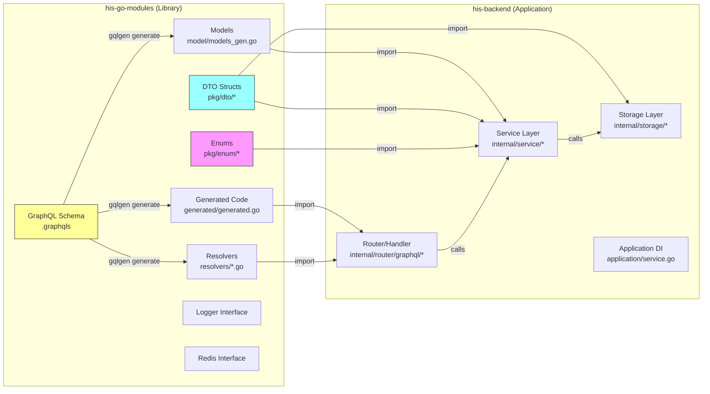
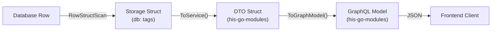
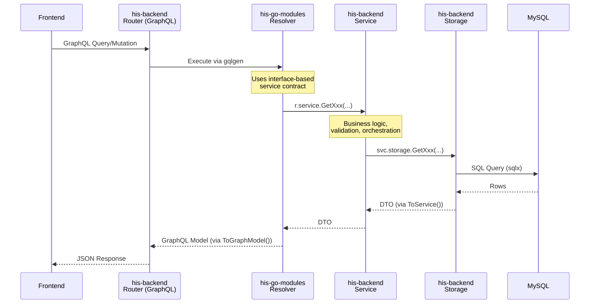

# Tutorial Pengembangan Fitur Baru — HIS v3

> **Dokumen ini menjelaskan**:
> 1. Bagaimana `his-go-modules` dan `his-backend` saling terhubung
> 2. Step-by-step tutorial membangun fitur CRUD baru dari nol
> 3. Tutorial menambah endpoint, field, dan cross-service dependency

---

## Bagian A: Koneksi `his-go-modules` ↔ `his-backend`

### 1. Gambaran Hubungan

`his-go-modules` adalah **shared library** yang dikonsumsi oleh `his-backend` melalui Go module system. Keduanya terkoneksi pada **3 titik utama**:



### 2. Tiga Titik Koneksi Utama

#### Titik 1: GraphQL (Schema → Resolver → Router)

| Lokasi | Repository | Peran |
|--------|-----------|-------|
| `.graphqls` schema files | `his-go-modules` | **Definisi API** — types, Query, Mutation |
| `generated/generated.go` | `his-go-modules` | Auto-generated server code |
| `model/models_gen.go` | `his-go-modules` | Auto-generated Go structs dari schema |
| `resolvers/*.resolvers.go` | `his-go-modules` | **Resolver logic** — konversi request → service call |
| `resolvers/resolver.go` | `his-go-modules` | **Interface contract** — mendefinisikan apa yang harus diimplementasi service |
| `internal/router/graphql/*/` | `his-backend` | **Mounting** — import resolver, pass service implementation |

**Contoh konkret (Diet module):**

```go
// 1. his-go-modules: resolver.go mendefinisikan interface
type service interface {
    GetPatientDietList(...) ([]*dietdto.PatientDietListItem, int, error)
    CreatePatientDietCompact(...) (*dietdto.EncounterDiet, error)
}

// 2. his-go-modules: diet.resolvers.go memanggil interface
func (r *queryResolver) GetPatientDietList(ctx context.Context, ...) (*model.PatientDietListResult, error) {
    listDto, count, err := r.service.GetPatientDietList(...)  // ← interface call
    listGql := make([]*model.PatientDietListItem, len(listDto))
    for i := range listDto { listGql[i] = listDto[i].ToGraphModel() }
    return &model.PatientDietListResult{Data: listGql}, nil
}

// 3. his-backend: diet.go (router) memasukkan implementasi konkret
func buildResolver(deps *application.Dependencies) *graph.Resolver {
    return graph.NewResolver(
        deps.Log,
        deps.AppServiceList.DietSvc,   // ← implementasi konkret dari his-backend service
        deps.AppServiceList.AuthSvc,
    )
}
```

#### Titik 2: DTO (Data Contract)

DTO didefinisikan di `his-go-modules` dan digunakan oleh **kedua** repository:

```
his-go-modules/pkg/dto/diet/
├── diet.go           → Manual structs + ToGraphModel() methods
└── diet_gen.go       → Generated structs (EncounterDiet, etc.)

Digunakan oleh:
  his-go-modules/pkg/graph/diet/resolvers/ → return types di resolver
  his-backend/internal/service/diet/       → parameter & return types di service
  his-backend/internal/storage/diet/       → ToService() konversi dari DB struct
```

**Alur konversi data:**



#### Titik 3: Enum (Shared Constants)

Enum didefinisikan di `his-go-modules` dan digunakan untuk **konsistensi** value di seluruh ekosistem:

```go
// his-go-modules/pkg/enum/encounter/status.go
const StatusPlanned = "planned"
const StatusArrived = "arrived"

// his-backend/internal/service/encounter/encounter.go
if encounter.Status == encounterstatus.StatusPlanned {
    // ...
}
```

### 3. Dependency Flow (Full Picture)



---

## Bagian B: Tutorial CRUD — Membuat Modul Baru dari Nol

Kita akan membuat modul **"Medical Note"** (Catatan Medis Singkat) sebagai contoh. Modul ini memiliki operasi CRUD lengkap.

> [!IMPORTANT]
> Setiap langkah menunjukkan **repository mana** yang perlu diubah dan **file mana** yang perlu dibuat/dimodifikasi.

### 📋 Checklist Overview

| Step | Repository | Aksi |
|------|-----------|------|
| 1 | `his-go-modules` | Buat DTO |
| 2 | `his-go-modules` | Buat GraphQL Schema |
| 3 | `his-go-modules` | Generate code (gqlgen) |
| 4 | `his-go-modules` | Implement resolver logic |
| 5 | `his-backend` | Update `go.mod` |
| 6 | `his-backend` | Buat Storage layer |
| 7 | `his-backend` | Buat Service layer |
| 8 | `his-backend` | Buat Router/Handler |
| 9 | `his-backend` | Register di `application/service.go` |
| 10 | `his-backend` | Mount route di `graphql/v1.go` |
| 11 | Keduanya | Validate & Test |

---

### Step 1: Buat DTO 📦 `his-go-modules`

Buat folder dan file DTO:

```
his-go-modules/pkg/dto/medicalnote/
└── medicalnote.go
```

```go
// his-go-modules/pkg/dto/medicalnote/medicalnote.go
package medicalnotedto

import (
    "time"
    dtostorage "github.com/developersismedika/his-go-modules/pkg/dto"
)

// MedicalNote adalah DTO utama untuk catatan medis
type MedicalNote struct {
    MedicalNoteID string    `json:"medicalNoteID"`
    EncounterID   string    `json:"encounterID"`
    PatientID     string    `json:"patientID"`
    Title         string    `json:"title"`
    Content       string    `json:"content"`
    NoteDate      time.Time `json:"noteDate"`
    NoteTime      string    `json:"noteTime"`
    PractitionerID string  `json:"practitionerID"`

    Meta dtostorage.Meta `json:"meta"`
}
```

> [!TIP]
> Untuk CRUD dasar, Anda juga bisa generate struct DTO menggunakan `golang-crud-generator` untuk membuat file `medicalnote_gen.go`. Tapi untuk custom fields, buat secara manual.

---

### Step 2: Buat GraphQL Schema 📝 `his-go-modules`

Buat folder module GraphQL lengkap. **Salin template** dari `graphtemplate`:

```bash
cp -r pkg/graph/graphtemplate pkg/graph/medicalnote
```

Kemudian buat file-file schema:

```
his-go-modules/pkg/graph/medicalnote/
├── gqlgen.yaml
├── graphqls/
│   ├── main.graphqls
│   ├── medicalnote.graphqls
│   └── medicalnoteinput.graphqls
├── model/
│   └── models.go
├── resolvers/
│   └── resolver.go
└── generated/
```

#### `graphqls/main.graphqls` — Base types

```graphql
type Meta {
  createdUserID: ID!
  createdDatetime: String!
  updatedUserID: ID
  updatedDatetime: String
}

interface NonPaginationType {
  status: Boolean!
  message: String!
}

interface PaginationType {
  status: Boolean!
  message: String!
  pagination: PaginationInfoType!
}

type PaginationInfoType {
  totalRow: Int!
  totalPage: Int!
  page: Int!
}

type Result implements NonPaginationType {
  status: Boolean!
  message: String!
}
```

#### `graphqls/medicalnote.graphqls` — Types + Query

```graphql
# Output types
type MedicalNote {
    medicalNoteID: ID!
    encounterID: ID!
    patientID: ID!
    title: String!
    content: String!
    noteDate: String!
    noteTime: String!
    practitionerID: ID!
    practitionerName: String
}

type MedicalNoteOneResult implements NonPaginationType {
    status: Boolean!
    message: String!
    data: MedicalNote
}

type MedicalNoteListResult implements PaginationType {
    status: Boolean!
    message: String!
    pagination: PaginationInfoType!
    data: [MedicalNote]!
}

type MedicalNoteCRUDResult implements NonPaginationType {
    status: Boolean!
    message: String!
    data: String!
}

# Queries
extend type Query {
    getMedicalNoteList(
        encounterID: ID
        patientID: ID
        page: Int
        take: Int
    ): MedicalNoteListResult!

    getMedicalNoteOne(
        medicalNoteID: ID!
    ): MedicalNoteOneResult!
}
```

#### `graphqls/medicalnoteinput.graphqls` — Inputs + Mutation

```graphql
input MedicalNoteCreateInput {
    encounterID: ID!
    title: String!
    content: String!
}

input MedicalNoteUpdateInput {
    medicalNoteID: ID!
    title: String!
    content: String!
}

extend type Mutation {
    medicalNoteCreate(data: MedicalNoteCreateInput!): MedicalNoteCRUDResult!
    medicalNoteUpdate(data: MedicalNoteUpdateInput!): MedicalNoteCRUDResult!
    medicalNoteDelete(medicalNoteID: ID!): Result!
}
```

#### `gqlgen.yaml` — Code generation config

```yaml
schema:
  - graphqls/*.graphqls

exec:
  filename: generated/generated.go
  package: generated

model:
  filename: model/models_gen.go
  package: model

resolver:
  layout: follow-schema
  dir: resolvers
  package: graph
  filename_template: "{name}.resolvers.go"

models:
  ID:
    model:
      - github.com/99designs/gqlgen/graphql.ID
      - github.com/99designs/gqlgen/graphql.Int
      - github.com/99designs/gqlgen/graphql.Int64
      - github.com/99designs/gqlgen/graphql.Int32
  Int:
    model:
      - github.com/99designs/gqlgen/graphql.Int
      - github.com/99designs/gqlgen/graphql.Int64
      - github.com/99designs/gqlgen/graphql.Int32
```

---

### Step 3: Generate Code ⚙️ `his-go-modules`

```bash
cd his-go-modules/pkg/graph/medicalnote
go get github.com/99designs/gqlgen@v0.17.45
go run github.com/99designs/gqlgen generate
```

Ini akan menghasilkan:

| File | Status | Boleh Edit? |
|------|--------|-------------|
| `generated/generated.go` | ✅ Baru dibuat | ❌ Jangan! |
| `model/models_gen.go` | ✅ Baru dibuat | ❌ Jangan! |
| `resolvers/medicalnote.resolvers.go` | ✅ Baru (stub) | ✅ Ya, implementasi di sini |
| `resolvers/medicalnoteinput.resolvers.go` | ✅ Baru (stub) | ✅ Ya, implementasi di sini |
| `resolvers/main.resolvers.go` | ✅ Baru (stub) | ✅ Biasanya kosong |

---

### Step 4: Implement Resolver Logic 🔧 `his-go-modules`

#### `resolvers/resolver.go` — Interface definition

```go
package graph

import (
    "context"

    medicalnotedto "github.com/developersismedika/his-go-modules/pkg/dto/medicalnote"
    sessiondto "github.com/developersismedika/his-go-modules/pkg/dto/session"
    "github.com/developersismedika/his-go-modules/pkg/graph/medicalnote/model"
    "github.com/developersismedika/his-go-modules/pkg/logger"
)

// service mendefinisikan SEMUA method yang harus diimplementasi oleh his-backend
type service interface {
    GetMedicalNoteList(encounterID, patientID *string, limit, offset int) ([]*medicalnotedto.MedicalNote, int, error)
    GetMedicalNoteOne(medicalNoteID string) (*medicalnotedto.MedicalNote, error)
    CreateMedicalNote(data *model.MedicalNoteCreateInput, userID string) (string, error)
    UpdateMedicalNote(data *model.MedicalNoteUpdateInput, userID string) error
    DeleteMedicalNote(ctx context.Context, medicalNoteID, userID string) error
}

type authService interface {
    ExtractSessionFromContext(ctx context.Context) (*sessiondto.Session, error)
}

type Resolver struct {
    service service
    authSvc authService
    log     logger.Interface
}

func NewResolver(log logger.Interface, service service, authSvc authService) *Resolver {
    return &Resolver{service: service, authSvc: authSvc, log: log}
}
```

> [!IMPORTANT]
> Interface `service` ini adalah **kontrak** yang menentukan apa yang harus diimplementasikan oleh `his-backend`. Jika method di interface ini tidak diimplementasi, Go compiler akan menolak build.

#### `resolvers/medicalnote.resolvers.go` — Query resolvers

```go
package graph

import (
    "context"

    "github.com/developersismedika/his-go-modules/pkg/graph/medicalnote/model"
    sqlutil "github.com/developersismedika/his-go-modules/pkg/utils/sql"
)

// GetMedicalNoteList is the resolver for getMedicalNoteList query
func (r *queryResolver) GetMedicalNoteList(ctx context.Context, encounterID *string,
    patientID *string, page *int, take *int) (*model.MedicalNoteListResult, error) {

    currentPage, limit, offset := sqlutil.BuildPageLimitOffset(page, take)

    listDto, count, err := r.service.GetMedicalNoteList(encounterID, patientID, limit, offset)
    if err != nil {
        return &model.MedicalNoteListResult{
            Status: false, Message: "gagal mendapatkan catatan medis",
            Pagination: &model.PaginationInfoType{}, Data: []*model.MedicalNote{},
        }, nil
    }

    // Konversi DTO → GraphQL model
    listGql := make([]*model.MedicalNote, len(listDto))
    for i := range listDto {
        listGql[i] = &model.MedicalNote{
            MedicalNoteID:  listDto[i].MedicalNoteID,
            EncounterID:    listDto[i].EncounterID,
            Title:          listDto[i].Title,
            Content:        listDto[i].Content,
            NoteDate:       listDto[i].NoteDate.Format("2006-01-02"),
            NoteTime:       listDto[i].NoteTime,
            PractitionerID: listDto[i].PractitionerID,
        }
    }

    return &model.MedicalNoteListResult{
        Status: true, Message: "success",
        Pagination: &model.PaginationInfoType{
            TotalRow: count, TotalPage: sqlutil.CalcTotalPage(count, limit), Page: currentPage,
        },
        Data: listGql,
    }, nil
}

// GetMedicalNoteOne is the resolver for getMedicalNoteOne query
func (r *queryResolver) GetMedicalNoteOne(ctx context.Context, medicalNoteID string) (*model.MedicalNoteOneResult, error) {
    noteDto, err := r.service.GetMedicalNoteOne(medicalNoteID)
    if err != nil {
        return &model.MedicalNoteOneResult{
            Status: false, Message: "gagal mendapatkan catatan medis",
        }, nil
    }

    return &model.MedicalNoteOneResult{
        Status: true, Message: "success",
        Data: &model.MedicalNote{
            MedicalNoteID: noteDto.MedicalNoteID,
            Title:         noteDto.Title,
            Content:       noteDto.Content,
        },
    }, nil
}
```

#### `resolvers/medicalnoteinput.resolvers.go` — Mutation resolvers

```go
package graph

import (
    "context"

    sessiondto "github.com/developersismedika/his-go-modules/pkg/dto/session"
    "github.com/developersismedika/his-go-modules/pkg/enum/session"
    "github.com/developersismedika/his-go-modules/pkg/graph/medicalnote/model"
)

// MedicalNoteCreate is the resolver for medicalNoteCreate mutation
func (r *mutationResolver) MedicalNoteCreate(ctx context.Context,
    data model.MedicalNoteCreateInput) (*model.MedicalNoteCRUDResult, error) {

    // 1. Extract session (user info)
    sessionData, err := r.authSvc.ExtractSessionFromContext(ctx)
    if err != nil {
        return &model.MedicalNoteCRUDResult{
            Status: false, Message: session.UserDataExtractionFailed,
        }, nil
    }

    // 2. Call service
    newID, err := r.service.CreateMedicalNote(&data, sessionData.UserID)
    if err != nil {
        return &model.MedicalNoteCRUDResult{
            Status: false, Message: err.Error(),
        }, nil
    }

    return &model.MedicalNoteCRUDResult{
        Status: true, Message: "sukses membuat catatan medis", Data: newID,
    }, nil
}

// MedicalNoteUpdate is the resolver for medicalNoteUpdate mutation
func (r *mutationResolver) MedicalNoteUpdate(ctx context.Context,
    data model.MedicalNoteUpdateInput) (*model.MedicalNoteCRUDResult, error) {

    sessionData, err := r.authSvc.ExtractSessionFromContext(ctx)
    if err != nil {
        return &model.MedicalNoteCRUDResult{
            Status: false, Message: session.UserDataExtractionFailed,
        }, nil
    }

    err = r.service.UpdateMedicalNote(&data, sessionData.UserID)
    if err != nil {
        return &model.MedicalNoteCRUDResult{
            Status: false, Message: err.Error(),
        }, nil
    }

    return &model.MedicalNoteCRUDResult{
        Status: true, Message: "sukses mengubah catatan medis",
    }, nil
}

// MedicalNoteDelete is the resolver for medicalNoteDelete mutation
func (r *mutationResolver) MedicalNoteDelete(ctx context.Context,
    medicalNoteID string) (*model.Result, error) {

    sessionData, err := r.authSvc.ExtractSessionFromContext(ctx)
    if err != nil {
        return &model.Result{Status: false, Message: session.UserDataExtractionFailed}, nil
    }

    err = r.service.DeleteMedicalNote(ctx, medicalNoteID, sessionData.UserID)
    if err != nil {
        return &model.Result{Status: false, Message: err.Error()}, nil
    }

    return &model.Result{Status: true, Message: "sukses menghapus catatan medis"}, nil
}
```

**Commit & push `his-go-modules`. Buat tag baru.**

```bash
cd his-go-modules
git add .
git commit -m "feat: add medical note module (GraphQL + DTO)"
git tag -a v0.X.X -m "add medical note module"
git push origin v0.X.X
```

---

### Step 5: Update `go.mod` 📥 `his-backend`

```bash
cd his-backend
go get github.com/developersismedika/his-go-modules@v0.X.X
go mod tidy
```

---

### Step 6: Buat Storage Layer 💾 `his-backend`

```
his-backend/internal/storage/medicalnote/
├── storage.go
├── medicalnote.go
└── medicalnote_gen.go  (opsional, via generator)
```

#### `storage.go`

```go
package medicalnotestorage

// Package declaration only - storage struct is in other files
```

#### `medicalnote.go` — Query implementations

```go
package medicalnotestorage

import (
    "context"
    "database/sql"
    "errors"
    "fmt"

    mysqlx "github.com/developersismedika/common-go-modules/pkg/mysqldb"
    medicalnotedto "github.com/developersismedika/his-go-modules/pkg/dto/medicalnote"
)

const TableMedicalNote = "medical_note"

// Storage struct — embeds mysqlx.Storage
type Storage struct {
    *mysqlx.Storage
}

// NewStorage creates new storage
func NewStorage(storageDb *mysqlx.Storage) *Storage {
    return &Storage{Storage: storageDb}
}

// DB struct untuk scanning results — BERBEDA dari DTO
type MedicalNoteRecord struct {
    MedicalNoteID  string         `db:"medical_note_id"`
    EncounterID    string         `db:"encounter_id"`
    PatientID      string         `db:"patient_id"`
    Title          string         `db:"title"`
    Content        string         `db:"content"`
    NoteDate       string         `db:"note_date"`
    NoteTime       string         `db:"note_time"`
    PractitionerID string         `db:"practitioner_id"`
    StatusCode     string         `db:"status_code"`
    CreatedDttm    string         `db:"created_dttm"`
    CreatedUserID  string         `db:"created_user_id"`
    UpdatedDttm    sql.NullString `db:"updated_dttm"`
    UpdatedUserID  sql.NullString `db:"updated_user_id"`
    NullifiedDttm  sql.NullString `db:"nullified_dttm"`
    NullifiedUserID sql.NullString `db:"nullified_user_id"`
}

// ToService converts DB struct → DTO
func (rec *MedicalNoteRecord) ToService() *medicalnotedto.MedicalNote {
    return &medicalnotedto.MedicalNote{
        MedicalNoteID:  rec.MedicalNoteID,
        EncounterID:    rec.EncounterID,
        PatientID:      rec.PatientID,
        Title:          rec.Title,
        Content:        rec.Content,
        PractitionerID: rec.PractitionerID,
    }
}

// GetByID retrieves one medical note by ID
func (store *Storage) GetMedicalNoteByID(medicalNoteID string) (*medicalnotedto.MedicalNote, error) {
    query := `SELECT medical_note_id, encounter_id, patient_id, title, content,
                     note_date, note_time, practitioner_id, status_code,
                     created_dttm, created_user_id
              FROM medical_note
              WHERE medical_note_id = :medical_note_id AND status_code = 'normal'`

    args := map[string]interface{}{
        "medical_note_id": medicalNoteID,
    }

    row, err := store.QueryRowxContext(TableMedicalNote, "GetMedicalNoteByID", query, args)
    if err != nil {
        return nil, store.ErrorQueryRowxContext(err)
    }
    defer row.Cancel()

    var rec MedicalNoteRecord
    err = store.RowStructScan(row, &rec)
    if errors.Is(err, sql.ErrNoRows) {
        return nil, nil
    }
    if err != nil {
        return nil, row.ErrorStructScan(err)
    }

    return rec.ToService(), nil
}

// GetList retrieves a list of medical notes
func (store *Storage) GetMedicalNoteList(encounterID, patientID *string,
    limit, offset int) ([]*medicalnotedto.MedicalNote, int, error) {

    args := map[string]interface{}{}
    whereClauses := []string{"mn.status_code = 'normal'"}

    if encounterID != nil && *encounterID != "" {
        whereClauses = append(whereClauses, "mn.encounter_id = :encounter_id")
        args["encounter_id"] = *encounterID
    }
    if patientID != nil && *patientID != "" {
        whereClauses = append(whereClauses, "mn.patient_id = :patient_id")
        args["patient_id"] = *patientID
    }

    whereStr := ""
    for i, clause := range whereClauses {
        if i == 0 {
            whereStr = "WHERE " + clause
        } else {
            whereStr += " AND " + clause
        }
    }

    fromClause := fmt.Sprintf("FROM medical_note mn %s", whereStr)

    // Count query
    countQuery := fmt.Sprintf("SELECT COUNT(*) %s", fromClause)
    count, err := store.CountQueryxContext(TableMedicalNote, "GetMedicalNoteList_Count",
        countQuery, args)
    if err != nil {
        return nil, 0, store.ErrorQueryxContext(err)
    }

    // Data query
    dataQuery := fmt.Sprintf(`SELECT mn.medical_note_id, mn.encounter_id, mn.patient_id,
        mn.title, mn.content, mn.note_date, mn.note_time, mn.practitioner_id
        %s ORDER BY mn.created_dttm DESC LIMIT %d OFFSET %d`, fromClause, limit, offset)

    rows, err := store.QueryxContext(TableMedicalNote, "GetMedicalNoteList", dataQuery, args)
    if err != nil {
        return nil, 0, store.ErrorQueryxContext(err)
    }
    defer rows.Cancel()

    var results []*medicalnotedto.MedicalNote
    for rows.Next() {
        var rec MedicalNoteRecord
        err = store.RowsStructScan(rows, &rec)
        if err != nil {
            return nil, 0, rows.ErrorStructScan(err)
        }
        results = append(results, rec.ToService())
    }

    return results, count, nil
}

// Insert creates a new medical note
func (store *Storage) InsertMedicalNote(ctx context.Context, data *medicalnotedto.MedicalNote) error {
    queryArgs := mysqlx.NamedExecArgs{
        Query: `INSERT INTO medical_note
            (medical_note_id, encounter_id, patient_id, title, content,
             note_date, note_time, practitioner_id, status_code, created_dttm, created_user_id)
            VALUES (:medical_note_id, :encounter_id, :patient_id, :title, :content,
             :note_date, :note_time, :practitioner_id, 'normal', NOW(), :created_user_id)`,
        Args: map[string]interface{}{
            "medical_note_id": data.MedicalNoteID,
            "encounter_id":    data.EncounterID,
            "patient_id":      data.PatientID,
            "title":           data.Title,
            "content":         data.Content,
            "note_date":       data.NoteDate,
            "note_time":       data.NoteTime,
            "practitioner_id": data.PractitionerID,
            "created_user_id": data.Meta.CreatedBy,
        },
    }

    tx := store.GetTransaction(ctx)
    return tx.NamedExec(TableMedicalNote, "InsertMedicalNote", queryArgs)
}

// SoftDelete soft-deletes a medical note
func (store *Storage) SoftDeleteMedicalNote(ctx context.Context, medicalNoteID, userID string) error {
    queryArgs := mysqlx.NamedExecArgs{
        Query: `UPDATE medical_note SET status_code = 'nullified',
                nullified_dttm = NOW(), nullified_user_id = :user_id
                WHERE medical_note_id = :medical_note_id`,
        Args: map[string]interface{}{
            "medical_note_id": medicalNoteID,
            "user_id":         userID,
        },
    }

    tx := store.GetTransaction(ctx)
    return tx.NamedExec(TableMedicalNote, "SoftDeleteMedicalNote", queryArgs)
}
```

---

### Step 7: Buat Service Layer 🧠 `his-backend`

```
his-backend/internal/service/medicalnote/
├── medicalnote.go          → Service struct + business logic
├── storageinterface.go     → Storage interface
└── importservice.go        → Cross-dependency imports (jika ada)
```

#### `storageinterface.go`

```go
package medicalnoteservice

import "github.com/developersismedika/common-go-modules/pkg/mysqldb"

type storage interface {
    mysqldb.TransactionStorage
    medicalNoteStorage
}
```

#### `medicalnote.go`

```go
package medicalnoteservice

import (
    "context"
    "fmt"
    "time"

    loginterface "github.com/developersismedika/common-go-modules/pkg/logger/interface"
    "github.com/developersismedika/common-go-modules/pkg/mysqldb"
    loggingutil "github.com/developersismedika/common-go-modules/pkg/utils/logging"
    medicalnotedto "github.com/developersismedika/his-go-modules/pkg/dto/medicalnote"
    "github.com/developersismedika/his-go-modules/pkg/graph/medicalnote/model"
    "github.com/google/uuid"
    "go.uber.org/zap"

    medicalnotestorage "github.com/developersismedika/his-backend/internal/storage/medicalnote"
)

const (
    ServiceMedicalNote = "MedicalNoteService"
    Module             = "MedicalNote"
)

// medicalNoteStorage interface — defines what storage methods we need
type medicalNoteStorage interface {
    GetMedicalNoteByID(medicalNoteID string) (*medicalnotedto.MedicalNote, error)
    GetMedicalNoteList(encounterID, patientID *string, limit, offset int) ([]*medicalnotedto.MedicalNote, int, error)
    InsertMedicalNote(ctx context.Context, data *medicalnotedto.MedicalNote) error
    SoftDeleteMedicalNote(ctx context.Context, medicalNoteID, userID string) error
}

// encounterService — cross-dependency (optional)
type encounterService interface {
    GetEncounterOne(encounterID string) (*encounterdto.Encounter, error)
}

type Service struct {
    log              loginterface.Interface
    storage          storage
    timezone         string
    encounterService encounterService // injected later via ImportEncounterService
}

func NewService(storageDB *mysqldb.Storage, timezone string) *Service {
    thisLogger := storageDB.Log
    thisLogger.SetBasicInformation("service", Module)

    return &Service{
        log:      storageDB.Log,
        storage:  medicalnotestorage.NewStorage(storageDB),
        timezone: timezone,
    }
}

// ----- Business Logic Methods -----

func (svc *Service) GetMedicalNoteList(encounterID, patientID *string,
    limit, offset int) ([]*medicalnotedto.MedicalNote, int, error) {

    list, count, err := svc.storage.GetMedicalNoteList(encounterID, patientID, limit, offset)
    if err != nil {
        filename, lineOfCode, functionName := loggingutil.GetCallerInfo(1)
        svc.log.ErrorService(err.Error(), functionName, "GetMedicalNoteList",
            filename, lineOfCode, nil)
        return nil, 0, fmt.Errorf("gagal mengambil daftar catatan medis")
    }
    return list, count, nil
}

func (svc *Service) GetMedicalNoteOne(medicalNoteID string) (*medicalnotedto.MedicalNote, error) {
    note, err := svc.storage.GetMedicalNoteByID(medicalNoteID)
    if err != nil {
        filename, lineOfCode, functionName := loggingutil.GetCallerInfo(1)
        args := []zap.Field{zap.String("medicalNoteID", medicalNoteID)}
        svc.log.ErrorService(err.Error(), functionName, "GetMedicalNoteByID",
            filename, lineOfCode, args)
        return nil, fmt.Errorf("gagal mengambil catatan medis")
    }
    return note, nil
}

func (svc *Service) CreateMedicalNote(data *model.MedicalNoteCreateInput,
    userID string) (string, error) {

    var err error
    newID := uuid.New().String()

    noteData := &medicalnotedto.MedicalNote{
        MedicalNoteID: newID,
        EncounterID:   data.EncounterID,
        Title:         data.Title,
        Content:       data.Content,
        NoteDate:      time.Now(),
        NoteTime:      time.Now().Format("15:04:05"),
    }
    noteData.Meta.CreatedBy = userID

    // Start transaction
    ctx := svc.storage.StartTransaction(context.Background(),
        mysqldb.TransactionModeBuffered, ServiceMedicalNote, "CreateMedicalNote")
    defer svc.storage.FinishTransaction(ctx, &err)

    err = svc.storage.InsertMedicalNote(ctx, noteData)
    if err != nil {
        return "", fmt.Errorf("gagal menyimpan catatan medis")
    }

    return newID, nil
}

func (svc *Service) DeleteMedicalNote(ctx context.Context,
    medicalNoteID, userID string) error {

    var err error

    txCtx := svc.storage.StartTransaction(ctx,
        mysqldb.TransactionModeBuffered, ServiceMedicalNote, "DeleteMedicalNote")
    defer svc.storage.FinishTransaction(txCtx, &err)

    err = svc.storage.SoftDeleteMedicalNote(txCtx, medicalNoteID, userID)
    if err != nil {
        return fmt.Errorf("gagal menghapus catatan medis")
    }
    return nil
}
```

#### `importservice.go` — Optional, jika ada cross-dependency

```go
package medicalnoteservice

func (svc *Service) ImportEncounterService(encounterService encounterService) {
    svc.encounterService = encounterService
}
```

---

### Step 8: Buat Router/Handler 🔌 `his-backend`

```
his-backend/internal/router/graphql/medicalnote/
└── medicalnote.go
```

```go
package medicalnote

import (
    "fmt"
    "net/http"

    "github.com/99designs/gqlgen/graphql/handler"
    "github.com/99designs/gqlgen/graphql/handler/extension"
    "github.com/99designs/gqlgen/graphql/handler/transport"
    "github.com/99designs/gqlgen/graphql/playground"
    "github.com/developersismedika/common-go-modules/pkg/graphqlhelper"
    "github.com/developersismedika/his-go-modules/pkg/graph/medicalnote/generated"
    graph "github.com/developersismedika/his-go-modules/pkg/graph/medicalnote/resolvers"
    "github.com/go-chi/chi/v5"

    "github.com/developersismedika/his-backend/internal/application"
)

const BaseRoute = "/medicalnote"

func BuildRouter(deps *application.Dependencies) http.Handler {
    r := chi.NewRouter()
    buildGraphQLHandler(r, deps)
    return r
}

func buildResolver(deps *application.Dependencies) *graph.Resolver {
    return graph.NewResolver(
        deps.Log,
        deps.AppServiceList.MedicalNoteSvc,  // ← dari AppServiceList
        deps.AppServiceList.AuthSvc,
    )
}

func buildGraphQLHandler(r *chi.Mux, deps *application.Dependencies) {
    baseServer := handler.New(generated.NewExecutableSchema(generated.Config{
        Resolvers: buildResolver(deps),
    }))
    server := graphqlhelper.NewGraphQLServer(baseServer, deps.Log)
    server.SetMyErrorPresenter()
    server.AddTransport(transport.POST{})
    server.Use(extension.Introspection{})
    server.SetMyRecoverFunc()

    r.Handle("/", playground.Handler("GraphQL playground",
        fmt.Sprintf("%s/query", BaseRoute)))
    r.Handle("/query", server)
}
```

---

### Step 9: Register di Application 📋 `his-backend`

Edit `internal/application/service.go` — **3 lokasi**:

#### 9a. Tambah import

```go
import (
    // ... existing imports ...
    medicalnotesvc "github.com/developersismedika/his-backend/internal/service/medicalnote"
)
```

#### 9b. Tambah field di `AppServiceList`

```go
type AppServiceList struct {
    // ... existing fields ...
    MedicalNoteSvc *medicalnotesvc.Service   // ← TAMBAH INI
}
```

#### 9c. Init di `BuildAllServiceAndValidate()`

```go
// Di bagian inisialisasi service (sekitar baris 600-700)
svc.MedicalNoteSvc = medicalnotesvc.NewService(
    storageDB,
    cfg.General.Timezone,
)
```

#### 9d. Import cross-deps (jika ada)

```go
func (svc *AppServiceList) importDepsForMedicalNoteService() {
    svc.MedicalNoteSvc.ImportEncounterService(svc.EncounterSvc)
}
```

Panggil di `BuildAllServiceAndValidate()`:
```go
svc.importDepsForMedicalNoteService()
```

#### 9e. Validasi di `utils.go`

```go
svc.totalServiceWithNilVars += svc.getAndPrintAllNilVariables(svc.MedicalNoteSvc, "MedicalNoteSvc")
```

---

### Step 10: Mount Route 🛤️ `his-backend`

Edit `internal/router/graphql/v1.go`:

```go
import (
    // ... existing imports ...
    medicalnotegraph "github.com/developersismedika/his-backend/internal/router/graphql/medicalnote"
)

// Di dalam function yang meng-mount semua routes
r.Mount(medicalnotegraph.BaseRoute, medicalnotegraph.BuildRouter(deps))
```

---

### Step 11: Validate & Test ✅

#### 11a. Build check

```bash
cd his-backend
go build ./...
```

#### 11b. Run locally

```bash
go run cmd/graphql/main.go
```

#### 11c. Test via GraphQL Playground

Buka `http://localhost:<port>/medicalnote/` → GraphQL Playground

```graphql
# Create
mutation {
  medicalNoteCreate(data: {
    encounterID: "enc-123"
    title: "Catatan Pemeriksaan"
    content: "Pasien mengeluh sakit kepala..."
  }) {
    status
    message
    data
  }
}

# Read List
query {
  getMedicalNoteList(encounterID: "enc-123", page: 1, take: 10) {
    status
    pagination { totalRow totalPage page }
    data {
      medicalNoteID
      title
      content
    }
  }
}

# Read One
query {
  getMedicalNoteOne(medicalNoteID: "xxx-xxx") {
    status
    data { medicalNoteID title content }
  }
}

# Delete
mutation {
  medicalNoteDelete(medicalNoteID: "xxx-xxx") {
    status
    message
  }
}
```

#### 11d. Buat .http test file

```
his-backend/resources/medicalnote/
└── medicalnote.http
```

---

## Bagian C: Tutorial Tambahan

### C1. Menambah Field di Modul Existing

| Step | Repo | Aksi |
|------|------|------|
| 1 | `his-go-modules` | Tambah field di `.graphqls` schema |
| 2 | `his-go-modules` | Run `gqlgen generate` |
| 3 | `his-go-modules` | Update DTO struct jika field bukan hanya GraphQL |
| 4 | `his-go-modules` | Update resolver jika field perlu logic khusus |
| 5 | `his-go-modules` | Commit + push + tag baru |
| 6 | `his-backend` | `go get ...@<tag>` |
| 7 | `his-backend` | Update storage query (add column ke SELECT) |
| 8 | `his-backend` | Update storage struct (add `db:` tag) |
| 9 | `his-backend` | Update `ToService()` mapping |
| 10 | `his-backend` | Test |

### C2. Menambah Endpoint ke Modul Existing

| Step | Repo | Aksi |
|------|------|------|
| 1 | `his-go-modules` | Tambah `Query` / `Mutation` di `.graphqls` |
| 2 | `his-go-modules` | Run `gqlgen generate` → baru stub resolver |
| 3 | `his-go-modules` | Implement resolver logic di `*.resolvers.go` |
| 4 | `his-go-modules` | Tambah method di interface `service` (di `resolver.go`) |
| 5 | `his-go-modules` | Commit + push + tag |
| 6 | `his-backend` | `go get ...@<tag>` |
| 7 | `his-backend` | Implement method baru di service |
| 8 | `his-backend` | Implement query baru di storage (jika perlu) |
| 9 | `his-backend` | Build & test |

### C3. Menambah Cross-Service Dependency

Ketika Service A perlu memanggil Service B:

```go
// 1. his-backend/internal/service/serviceA/serviceA.go
// Definisikan interface lokal
type serviceBDependency interface {
    GetSomething(id string) (*SomeDTO, error)
}

type Service struct {
    // ...
    serviceBDep serviceBDependency  // ← tambah field
}

// 2. his-backend/internal/service/serviceA/importservice.go
func (svc *Service) ImportServiceB(dep serviceBDependency) {
    svc.serviceBDep = dep
}

// 3. his-backend/internal/application/service.go
func (svc *AppServiceList) importDepsForServiceA() {
    svc.ServiceASvc.ImportServiceB(svc.ServiceBSvc)
}
```

> [!CAUTION]
> Jangan pernah import service secara langsung via constructor `NewService()` jika ada potensi **circular dependency**. Selalu gunakan pattern `Import*Service()`.

---

## Bagian D: Quick Reference

### Mapping File Antar Repository

| `his-go-modules` | `his-backend` | Relasi |
|-------------------|---------------|--------|
| `pkg/graph/<mod>/graphqls/*.graphqls` | — | Schema didefine di modules |
| `pkg/graph/<mod>/generated/generated.go` | `internal/router/graphql/<mod>/<mod>.go` | Router import generated code |
| `pkg/graph/<mod>/resolvers/resolver.go` | `internal/service/<mod>/<mod>.go` | Interface = Service contract |
| `pkg/graph/<mod>/resolvers/*.resolvers.go` | — | Resolver logic lives in modules |
| `pkg/dto/<mod>/*.go` | `internal/storage/<mod>/*_gen.go` | Storage converts to DTO |
| `pkg/enum/<mod>/*.go` | `internal/service/<mod>/*.go` | Service uses enums |

### Naming Conventions

| Item | his-go-modules | his-backend |
|------|---------------|-------------|
| Package | `medicalnotedto`, `model` | `medicalnoteservice`, `medicalnotestorage` |
| DTO struct | `MedicalNote` | — (import dari modules) |
| Storage struct | — | `MedicalNoteRecord` (with `db:` tags) |
| GraphQL model | `model.MedicalNote` (generated) | — (import dari modules) |
| Service | — | `Service` (in package `medicalnoteservice`) |
| Interface | `service` (lowercase, private) | `storage`, `medicalNoteStorage` |

### Alur Data Summary

```
Frontend → GraphQL Query
  → his-backend Router (imports generated + resolver from his-go-modules)
    → his-go-modules Resolver (calls interface method)
      → his-backend Service (implements interface, contains business logic)
        → his-backend Storage (SQL queries, returns DTO from his-go-modules)
          → MySQL Database
```
